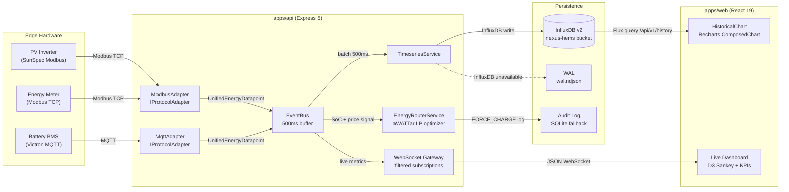

<div align="center">

# ⚡ Nexus-HEMS Dashboard

**Production-grade Home Energy Management System — One Command Center for the decentralized energy era**

[](https://github.com/qnbs/Nexus-HEMS-Dash/actions/workflows/ci.yml)
[](https://github.com/qnbs/Nexus-HEMS-Dash/actions/workflows/deploy.yml)
[](LICENSE)
[](https://github.com/qnbs/Nexus-HEMS-Dash/releases)
[](tsconfig.json)
[](package.json)
[](https://pnpm.io/)
[](.nvmrc)
[](apps/web/.storybook/main.ts)
[](apps/web/src/tests/)
[](apps/web/tests/e2e/)
[-22ff88?style=flat-square>)](#protocol-adapters)
[](https://securityscorecards.dev/viewer/?uri=github.com/qnbs/Nexus-HEMS-Dash)
[](https://codecov.io/gh/qnbs/Nexus-HEMS-Dash)

**[Live Demo](https://qnbs.github.io/Nexus-HEMS-Dash/)** · **[Open in Codespaces](https://codespaces.new/qnbs/Nexus-HEMS-Dash)** · **[Adapter Dev Guide](docs/Adapter-Dev-Guide.md)** · **[Storybook](apps/web/.storybook/main.ts)**

</div>

---

Nexus-HEMS is a **unified Command Center** that consolidates **13 protocol adapters** (7 core + 6 contrib) into **8 primary routes across 7 navigation sections** — orchestrating photovoltaic generation, battery storage, heat pumps, EV charging, and building automation with dynamic electricity tariffs. Instead of 18+ separate pages, every feature is accessible from a **single streamlined interface** with guided tours, contextual help, and zero-config onboarding.

The current shipped release line is **1.1.0**. Active **v1.2.0** work is tracked in [CHANGELOG.md](CHANGELOG.md) and [docs/Technical-Debt-Registry.md](docs/Technical-Debt-Registry.md); treat those files as in-flight roadmap context rather than shipped baseline.

For verified roadmap status and completion boundaries, use these documents as the primary references:
- [docs/Security-Roadmap-2026.md](docs/Security-Roadmap-2026.md) for implemented vs partial vs deferred security work
- [docs/Performance-Optimization-Plan.md](docs/Performance-Optimization-Plan.md) for implemented vs pending performance work
- [docs/Accessibility-Testing-Guide.md](docs/Accessibility-Testing-Guide.md) for automated vs manual accessibility coverage
- [docs/Tariff-Providers-Setup.md](docs/Tariff-Providers-Setup.md) for provider support and setup status
- [docs/Home-Assistant-Integration-Guide.md](docs/Home-Assistant-Integration-Guide.md) for the Home Assistant MQTT contrib adapter
- [docs/Deployment-Guide.md](docs/Deployment-Guide.md) and [docs/Toolchain-Architecture.md](docs/Toolchain-Architecture.md) for deploy/tooling truth

**Stack:** React 19 · TypeScript 5.8 · Vite 8 (Rolldown) · Tailwind CSS v4 · Zustand 5 · D3.js Sankey · Recharts · Motion · Dexie.js · Radix UI · React Compiler

## Key Features

| Category                | Features                                                                                                                                                                                                                                                                                                 |
| :---------------------- | :------------------------------------------------------------------------------------------------------------------------------------------------------------------------------------------------------------------------------------------------------------------------------------------------------- |
| **Energy**              | Real-time D3.js Sankey flow · AI optimizer (multi-provider BYOK) · MPC day-ahead optimizer · 8 real-time controllers · 24h/7d predictive forecast · Live tariff widget (Tibber/aWATTar/Octopus/Nordpool) · Smart EV charging (§14a EnWG) · SG Ready heat pump control · Hardware registry (120+ devices) |
| **Protocols (Core)**    | Victron MQTT (Cerbo GX / Venus OS) · Modbus/SunSpec (103/124/201) · KNX/IP floorplan · OCPP 2.1 V2X (ISO 15118) · EEBUS SPINE/SHIP (TLS 1.3 mTLS) · evcc backend · OpenEMS Edge (JSON-RPC)                                                                                                               |
| **Protocols (Contrib)** | Home Assistant MQTT · Matter/Thread · Zigbee2MQTT · Shelly REST (Gen2+) · OpenADR 3.1 VEN · Example template                                                                                                                                                                                             |
| **Plugin System**       | Adapter Registry with dynamic `import()` loading · npm-package format · `BaseAdapter` class for rapid development · Hot-loading from Settings UI                                                                                                                                                         |
| **Platform**            | Unified Command Center (7 sections) · PWA offline-first (Workbox + IndexedDB) · 5 themes · Full i18n (DE/EN) · WCAG 2.2 AA · PDF reports + QR sharing · Prometheus monitoring                                                                                                                            |
| **Security**            | BYOK AI vault (AES-GCM 256) · JWT WebSocket auth · Helmet CSP · Rate limiting · CORS · Zod schema validation                                                                                                                                                                                             |
| **Desktop & Mobile**    | Tauri v2.2 (Windows/macOS/Linux) · Capacitor 7 (iOS/Android)                                                                                                                                                                                                                                             |

## Architecture

### Monorepo Structure (pnpm + Turborepo)

```
apps/api/               @nexus-hems/api    — Express 5 + WebSocket backend (port 3000)
apps/web/               @nexus-hems/web    — React 19 Vite SPA (port 5173 in dev)
packages/shared-types/  @nexus-hems/shared-types — Zod schemas + types (protocol.ts)
```

In development, `apps/web` (Vite) proxies `/api/*`, `/metrics`, and `/ws` requests to `apps/api` (Express).

### Data Flow

#### Frontend Adapters → UI

```
┌─────────────────── Core Adapters (7) ─────────────────┐
│  Victron Cerbo GX ──┐                                 │
│  Modbus/SunSpec ─────┤                                │
│  KNX/IP Gateway ─────┤                                │
│  OCPP 2.1 CSMS ──────┼── EnergyAdapter ──┐            │
│  EEBUS CEM ──────────┤     interface     │            │
│  evcc backend ───────┤                   │            │
│  OpenEMS Edge ───────┘                   │            │
└──────────────────────────────────────────┘            │
┌──────────── Contrib Adapters (Plugin, 6) ────────────┐│
│  Home Assistant MQTT ──┐                             ││
│  Matter/Thread ────────┤                             ││
│  Zigbee2MQTT ──────────┼── BaseAdapter ──────────────┼┤
│  Shelly REST ──────────┤   (extends EnergyAdapter)   ││
│  OpenADR 3.1 VEN ──────┤                             ││
│  Custom (npm pkg) ─────┘                             ││
└──────────────────────────────────────────────────────┘│
                                                        ▼
          useEnergyStore (Zustand) ──→ UnifiedEnergyModel
                     │
                     ├──→ D3.js Sankey + Recharts (UI)
                     ├──→ ControllerPipeline (8 real-time controllers)
                     ├──→ MPC Optimizer (LP day-ahead scheduling)
                     ├──→ AI Optimizer (Gemini / OpenAI / Anthropic / xAI / Groq / Ollama)
                     ├──→ Hardware Registry (120+ certified devices)
                     └──→ Dexie.js IndexedDB (Offline Cache)
```

#### Backend Adapters → Time-Series → Dashboard



All adapters implement the `EnergyAdapter` interface (`apps/web/src/core/adapters/EnergyAdapter.ts`). Contrib adapters extend `BaseAdapter` (`apps/web/src/core/adapters/BaseAdapter.ts`) for simplified development. The `AdapterRegistry` (`apps/web/src/core/adapters/adapter-registry.ts`) manages registration, lifecycle, and dynamic loading.

## Quick Start

```bash
git clone https://github.com/qnbs/Nexus-HEMS-Dash.git
cd Nexus-HEMS-Dash
corepack enable
pnpm install
pnpm dev
```

**Requirements:** Node.js 24 LTS (production baseline), pnpm 10+ via Corepack

### GitHub Codespaces (Zero-Config)

Click the button below to open a fully configured development environment in your browser:

[](https://codespaces.new/qnbs/Nexus-HEMS-Dash?quickstart=1)

**Recommended machine type:** 4-core / 8 GB RAM (builds complete in ~30s)

The Codespace includes Node.js 24, pnpm, Playwright, Docker, and all VS Code extensions pre-installed. Dependencies are cached via Codespaces prebuilds for near-instant startup.

### Scripts

| Command              | Description                                                          |
| :------------------- | :------------------------------------------------------------------- |
| `pnpm dev`           | Turborepo dev — apps/api (port 3000) + apps/web (port 5173) with HMR |
| `pnpm build`         | Turborepo build — all packages in dependency order                   |
| `pnpm test`          | Turbo test watch mode across workspace packages                      |
| `pnpm test:run`      | All unit tests once                                                  |
| `pnpm test:e2e`      | Playwright E2E (local Chromium-only; CI runs Chromium + Firefox)      |
| `pnpm test:coverage` | V8 coverage report                                                   |
| `pnpm lint`          | Biome + React ESLint across all workspaces (zero-warning policy)     |
| `pnpm type-check`    | TypeScript strict check across all workspaces                        |
| `pnpm verify:basis`  | Full local gate: type-check + lint + test:run                        |
| `pnpm docker:build`  | Build Docker image                                                   |
| `pnpm docker:up`     | Start container (port 8080)                                          |

### Environment Variables

All AI API keys are managed via the BYOK Settings page (`/settings/ai`) with AES-GCM 256-bit encryption — no `.env` file needed for AI features.

```bash
# --- Server (required in production) ---
JWT_SECRET=...               # HMAC-SHA256 secret (min 64 chars, cryptographically random)
API_KEYS=...                 # Comma-separated API keys for /api/auth/token (production)
CORS_ORIGINS=https://...     # Optional: additional CORS origins
WS_ORIGINS=wss://...         # Required in production: WebSocket origins for CSP connect-src
ADAPTER_MODE=mock            # Optional: 'mock' for demo mode, 'live' for real hardware (default: live)
RATE_LIMIT_TRUSTED_IPS=...   # Optional: IPs exempt from rate limiting (load balancers)
PROMETHEUS_BEARER_TOKEN=...  # Optional: Bearer token for /metrics endpoint authentication
PORT=3000                    # Default: 3000

# --- InfluxDB Time-Series DB (optional — defaults work with docker-compose.yml) ---
INFLUXDB_URL=http://influxdb:8086     # InfluxDB v2 base URL
INFLUXDB_TOKEN=nexus-hems-influx-token # Write/read auth token
INFLUXDB_ORG=nexus-hems              # Organisation name
INFLUXDB_BUCKET=nexus-hems           # Target bucket

# --- Energy Router (optional) ---
AWATTAR_BASE_URL=https://api.awattar.de/v1  # aWATTar DE Day-Ahead prices (no API key needed)
```

## Unified Routes & Sections

| Section                  | Route              | Description                                                      |
| :----------------------- | :----------------- | :--------------------------------------------------------------- |
| **Command Hub**          | `/`                | KPI dashboard, mini Sankey, quick-nav to all sections            |
| **Live Energy Flow**     | `/energy-flow`     | Full D3.js Sankey + live price widget + fullscreen mode          |
| **Devices & Automation** | `/devices`         | Device cards, KNX floorplan, controllers, hardware — all in one  |
| **AI Optimization**      | `/optimization-ai` | 3-step AI wizard (Gemini + MPC), predictive forecast             |
| **Tariffs**              | `/tariffs`         | Live prices, forecasts, optimal charging windows                 |
| **Analytics**            | `/analytics`       | 8 KPIs, energy balance, costs, historical trends                 |
| **Monitoring**           | `/monitoring`      | System health, adapter matrix, metrics, power-user mode          |
| **Settings**             | `/settings`        | Appearance, system, energy, security, adapters, plugins, AI keys |
| **Help**                 | `/help`            | Docs, FAQ, glossary, shortcuts, troubleshooting, about & credits |

> Legacy routes (`/production`, `/storage`, `/consumption`, `/ev`, `/floorplan`, `/ai-optimizer`, `/controllers`, `/hardware`) automatically redirect to their new unified sections.

## Protocol Adapters

### Core Adapters (7)

| Adapter              | Protocol              | Transport        | Security     | Capabilities               |
| :------------------- | :-------------------- | :--------------- | :----------- | :------------------------- |
| VictronMQTTAdapter   | Node-RED MQTT→WS      | WebSocket        | Token auth   | PV, Battery, Grid, Load    |
| ModbusSunSpecAdapter | SunSpec 103/124/201   | HTTP/REST        | TLS          | PV, Battery, Grid          |
| KNXAdapter           | KNX/IP Tunneling      | WebSocket bridge | —            | KNX building automation    |
| OCPP21Adapter        | OCPP 2.1 JSON-RPC     | WebSocket        | Client certs | EV Charger, V2X, ISO 15118 |
| EEBUSAdapter         | SPINE/SHIP 1.0        | WebSocket        | TLS 1.3 mTLS | EV Charger, Load, Grid     |
| EvccAdapter          | evcc REST + WebSocket | HTTP + WS        | —            | 95%+ inverters/wallboxes   |
| OpenEMSAdapter       | JSON-RPC 2.0          | WebSocket        | —            | OpenEMS Edge controllers   |

### Contrib Adapters (6) — Plugin System

| Adapter                  | Protocol                | Transport    | Use Case                                          |
| :----------------------- | :---------------------- | :----------- | :------------------------------------------------ |
| HomeAssistantMQTTAdapter | MQTT Discovery          | WebSocket    | Home Assistant integration (Mosquitto)            |
| MatterThreadAdapter      | Matter 1.3 / Thread 1.3 | WebSocket    | Matter-certified smart home devices               |
| Zigbee2MQTTAdapter       | MQTT (Z2M bridge)       | WebSocket    | Zigbee devices via Zigbee2MQTT bridge             |
| ShellyRESTAdapter        | HTTP/REST Gen2+         | HTTP polling | Shelly Pro 3EM, Plus Plug S, Pro 4PM              |
| OpenADR31Adapter         | OpenADR 3.1.0           | HTTPS        | VEN client for demand-response events from a VTN  |
| ExampleContribAdapter    | —                       | —            | Template for custom adapter development           |

### Plugin System & Adapter Registry

The adapter registry (`apps/web/src/core/adapters/adapter-registry.ts`) supports three ways to add adapters:

```typescript
// 1. Static registration
import { registerAdapter } from './adapter-registry';
registerAdapter('my-adapter', (config) => new MyAdapter(config));

// 2. Dynamic loading from contrib/
await loadContribAdapter('homeassistant-mqtt');

// 3. Load all contrib adapters at once
const ids = await loadAllContribAdapters();
```

Contrib adapters extend `BaseAdapter` for simplified development:

```typescript
import { BaseAdapter } from '../BaseAdapter';
import type { EnergyAdapter, UnifiedEnergyModel } from '../EnergyAdapter';

export class MyAdapter extends BaseAdapter implements EnergyAdapter {
  readonly id = 'my-adapter';
  readonly protocol = 'my-protocol';
  // ... implement connect(), disconnect(), getData()
}
```

See [Adapter Dev Guide](docs/Adapter-Dev-Guide.md) and [Contrib README](apps/web/src/core/adapters/contrib/README.md) for full documentation.

## Security

- **Backend:** Helmet CSP + HSTS + COEP, CORS allowlist, Zod schema validation, JWT (HS256) auth, rate limiting (global 100/min, API 60/min, auth 10/min per IP), brute-force protection on auth endpoints
- **WebSocket:** JWT token auth, command whitelist, 64 KB max payload, 30 cmd/min per client
- **JWT Hardening:** Entropy validation at startup — warns on weak secrets, dictionary words, keys < 64 chars
- **Trusted-IP Bypass:** `RATE_LIMIT_TRUSTED_IPS` env var for load balancers and internal proxies
- **Encryption:** AES-GCM 256-bit + PBKDF2 600k iterations for API keys in IndexedDB
- **Transport:** TLS 1.3 everywhere, mTLS for EEBUS, client certs for OCPP
- **Docker:** Non-root, read-only filesystem, `no-new-privileges`, isolated networks, per-IP connection limits (`limit_conn 50`)
- **Runtime Hardening:** strict OpenEMS component/property validation, worker URL allowlist + private-IP checks, sanitized plugin/event logging
- **CI:** CodeQL SAST, pnpm audit, Dependabot (npm ecosystem + Actions + Docker + Cargo), SHA-pinned GitHub Actions

For the full threat model, trust boundaries, STRIDE analysis, and GDPR/DSGVO compliance details, see [SECURITY.md](SECURITY.md).

## Testing

| Type       | Tool                                               | Scope                   |
| :--------- | :------------------------------------------------- | :---------------------- |
| Unit       | Vitest + jsdom + V8 coverage                       | Workspace unit suites   |
| E2E        | Playwright (local Chromium; CI Chromium + Firefox) | Multi-route, a11y audit |
| a11y       | @axe-core/playwright                               | WCAG 2.2 AA             |
| Lighthouse | Lighthouse CI                                      | Perf ≥ 85%, A11y ≥ 90%  |

## Deployment

**GitHub Pages** — manual deployment via GitHub Actions `workflow_dispatch` with explicit `DEPLOY` approval token.

**Docker** — multi-stage build (node:24-alpine → nginx:1.29-alpine):

```bash
pnpm docker:build && pnpm docker:up
```

**Helm/Kubernetes** — supports immutable image digests (`repository@sha256:...`), rolling update strategy controls, and revision history for rollback.

**Tauri Desktop** — native builds for Windows, macOS, Linux:

```bash
pnpm tauri build
# Config: apps/web/src-tauri/tauri.conf.json
```

## Design System

**Neo-Energy Cyber-Glassmorphism** with 5 themes:

| Theme         | ID              | Mode  | Aesthetic                                  |
| :------------ | :-------------- | :---- | :----------------------------------------- |
| Ocean Deep    | `ocean-dark`    | Dark  | Deep ocean blues + neon accents (default)  |
| Energy Dark   | `energy-dark`   | Dark  | Vibrant greens + electric highlights       |
| Solar Light   | `solar-light`   | Light | Warm solar tones                           |
| Minimal       | `minimal-white` | Light | Ultra-clean minimalism                     |
| Forest        | `nature-green`  | Dark  | Forest greens + earth tones                |

Brand colors: `neon-green` (#22ff88) · `electric-blue` (#00f0ff) · `power-orange` (#ff8800). See [DESIGN-SYSTEM.md](DESIGN-SYSTEM.md) for the full pattern catalog.

## Roadmap 2026

| Quarter | Feature                                                                                                                                            | Status     |
| :------ | :------------------------------------------------------------------------------------------------------------------------------------------------- | :--------- |
| Q1–Q3   | 5 core adapters, 5 themes, AI optimizer, EEBUS, PWA, Monitoring, Docker, Tauri, WCAG 2.2 AA, React Compiler, Backend hardening                     | ✅ Shipped |
| Q3      | Plugin system, adapter registry, 5 contrib adapters (Home Assistant, Matter/Thread, Zigbee2MQTT, Shelly), Capacitor Mobile                         | ✅ Shipped |
| Q3–Q4   | Energy controllers (8 loops), MPC optimizer, hardware registry (120+ devices), plugin lifecycle, command safety, expanded unit coverage            | ✅ Shipped |
| Q1 2026 | Opt#1 + Opt#2 Zustand/React 19 compiler cleanup, 6 new test suites (circuit-breaker, tariff-providers, notifications, energy-context, +extensions) | ✅ Shipped |
| Q4      | **Unified Command Center** — 7 focused sections, guided tours, contextual help, zero-config onboarding, full a11y audit                            | ✅ Shipped |
| Q2 2026 | **pnpm/Turborepo Monorepo** — `apps/api` + `apps/web` + `packages/shared-types`; two-process dev; Turbo caching across all workspaces               | ✅ Shipped |
| Q4+     | Historical analytics, multi-tenant SaaS, contrib marketplace                                                                                       | 🔜 Planned |

## Changelog

<details open>
<summary><b>v1.1.0</b> — Mobile, Tariffs, Toolchain, and CI Hardening</summary>

- **Capacitor Mobile:** Capacitor 7 configuration for iOS/Android native shells and push-ready app metadata
- **Tariff Providers:** Tibber, aWATTar DE/AT, Octopus Energy, Nordpool, and dynamic grid fees
- **Unified Command Center:** 7 focused sections with legacy route redirects, guided tours, empty states, and contextual help
- **Adapter Platform:** 13 adapters total (7 core + 6 contrib), contrib plugin loading, lifecycle management, and monitoring health views
- **Controller Stack:** ESS, peak shaving, tariff-aware charging, self-consumption, emergency reserve, heat pump SG Ready, EV smart charging, and EV V2G discharge loops
- **Security & CI:** JWT/WebSocket hardening, Node 24 CI baseline, dependency overrides, pnpm audit workflow, and Biome-first checks
- **A11y & i18n:** WCAG 2.2 AA fixes, forced-colors/reduced-motion support, and complete DE/EN localization coverage for new UI
</details>

<details>
<summary><b>v1.0.0</b> — Production HEMS Dashboard Baseline</summary>

- **React 19 SPA:** Vite 8, Tailwind CSS v4, React Compiler, Zustand, TanStack Query, and React Router DOM v7
- **Energy Visualization:** Real-time D3 Sankey flow, Recharts analytics, KPI dashboard, and KNX floorplan
- **Backend:** Express 5 API, WebSocket energy stream, mock/live adapter mode, JWT auth, metrics, and Grafana export
- **Offline & PWA:** Dexie cache, background sync, install/update prompts, and Workbox runtime caching
- **AI Optimization:** Multi-provider BYOK client, encrypted IndexedDB key vault, MPC optimizer, predictive forecast, and AI worker isolation
- **Deployment:** GitHub Pages, Docker/nginx, Helm/Kubernetes, Tauri desktop, and Capacitor mobile targets
</details>

Full changelog: [git history](https://github.com/qnbs/Nexus-HEMS-Dash/commits/main)

## Acknowledgments

This project was built with the assistance of cutting-edge AI tools that accelerated development, improved code quality, and enabled rapid iteration:

| AI Assistant        | Provider                   | Contribution                                                                               |
| :------------------ | :------------------------- | :----------------------------------------------------------------------------------------- |
| **Gemini 2.5 Pro**  | Google AI Studio           | Energy optimization algorithms, predictive forecasting, MPC solver design, tariff analysis |
| **Claude Opus 4.6** | Anthropic (GitHub Copilot) | Architecture design, React Compiler compliance, a11y audit, E2E tests, design system, i18n |
| **Grok**            | xAI                        | Code review, debugging assistance, protocol adapter research                               |

We are deeply grateful to these AI platforms for enabling a solo developer to build what would traditionally require a full engineering team. The combination of human domain expertise in energy management with AI-assisted development has made Nexus-HEMS possible.

**Additional thanks to:**

- **Victron Energy** — Cerbo GX, VE.Bus, Venus OS open documentation
- **KNX Association** — KNX/IP building automation standard
- **Tibber & aWATTar** — Dynamic electricity tariff APIs
- **D3.js community** — Data-driven visualization excellence
- **EMHASS** — MPC/LP optimization concepts and research
- **OpenEMS** — OSGi controller architecture inspiration
- **evcc** — EV charging integration patterns
- **React, Vite, Tailwind CSS** — The incredible open-source ecosystem that powers everything

## Troubleshooting

| Problem                                           | Fix                                                                            |
| :------------------------------------------------ | :----------------------------------------------------------------------------- |
| Deploy workflow fails with `HttpError: Not Found` | Enable GitHub Pages Source → **GitHub Actions** in repo Settings → Pages       |
| Node.js action runtime warnings in CI             | CI uses Node.js 24 and JavaScript actions are forced to Node 24 via workflow env |
| Lighthouse `errors-in-console` assertion failures | Expected in demo mode without real backend — assertion is set to `off`         |
| `pnpm install` fails with Corepack error          | Run `corepack enable && corepack prepare pnpm@latest --activate`               |
| TypeScript errors after pull                      | Run `pnpm install` then `pnpm type-check`                                      |

## Contributing

Contributions welcome! See [CONTRIBUTING.md](CONTRIBUTING.md).

```bash
pnpm verify:basis
```

## License

MIT — see [LICENSE](LICENSE).

---

<div align="center">

## 🇩🇪 Überblick

</div>

**Nexus-HEMS Dashboard** ist ein produktionsreifes Echtzeit-Home-Energy-Management-System — **ein einziges Command Center** für die dezentrale Energiewende. Es vereint **13 Protokolladapter** (7 Core + 6 Contrib) in **7 fokussierten Sektionen** zur Orchestrierung von PV, Batteriespeicher, Wärmepumpen und E-Mobilität — optimiert für dynamische Stromtarife (Tibber/aWATTar/Octopus/Nordpool).

- ⚡ Echtzeit D3.js Sankey-Energiefluss mit KI-Optimierung (Gemini 2.5 Pro)
- 🎯 Unified Command Center: 7 Sektionen statt 18+ Einzelseiten
- 🔌 10 Adapter: Victron, Modbus, KNX, OCPP, EEBUS + Home Assistant, Matter/Thread, Zigbee2MQTT, Shelly
- 🧩 Plugin-System: Adapter-Registry mit dynamischem Laden, npm-Paket-Format, BaseAdapter-Klasse
- 🎛️ 8 Echtzeit-Energieregler: ESS, Peak Shaving, Netz-optimiert, Eigenverbrauch, Notstrom, SG Ready, EV Smart, EV V2G Entladung
- 📐 MPC-Optimierer: EMHASS-inspirierter LP Day-Ahead-Scheduler mit Tariferkennung
- 🗃️ Hardware-Registry: 120+ zertifizierte Geräte (Wechselrichter, Wallboxen, Zähler, Batterien, Wärmepumpen)
- 🚗 Intelligentes EV-Laden (PV-Überschuss, §14a EnWG, SG Ready, V2X)
- 🏠 KNX-Grundriss mit interaktiver Gebäudeautomation
- 📈 Prädiktive Vorhersage + Live-Tarif-Widget (5 Anbieter)
- 🔐 BYOK KI-Tresor (7 Anbieter, AES-GCM 256-bit)
- 📱 PWA Offline-First + Tauri Desktop + Capacitor Mobile
- ♿ WCAG 2.2 AA · 🌐 i18n DE/EN · 🎨 5 Themes
- 🧪 Coverage-gatete Unit-Tests · 📄 PDF-Berichte · 🔒 JWT + Helmet + CORS
- 🤖 KI-unterstützt: Gemini 2.5 Pro, Claude Opus 4.6, Grok (xAI)

```bash
git clone https://github.com/qnbs/Nexus-HEMS-Dash.git && cd Nexus-HEMS-Dash
corepack enable && pnpm install && pnpm dev
```

**Docs:** [DESIGN-SYSTEM.md](DESIGN-SYSTEM.md) · [CONTRIBUTING.md](CONTRIBUTING.md) · [SECURITY.md](SECURITY.md) · [Adapter-Dev-Guide](docs/Adapter-Dev-Guide.md) · [Contrib-Adapter-README](apps/web/src/core/adapters/contrib/README.md)

**Lizenz:** MIT — siehe [LICENSE](LICENSE).
