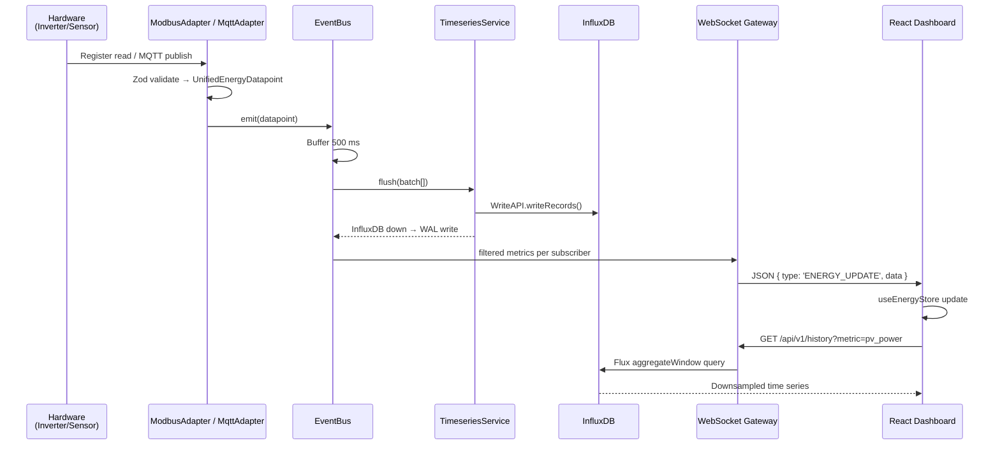
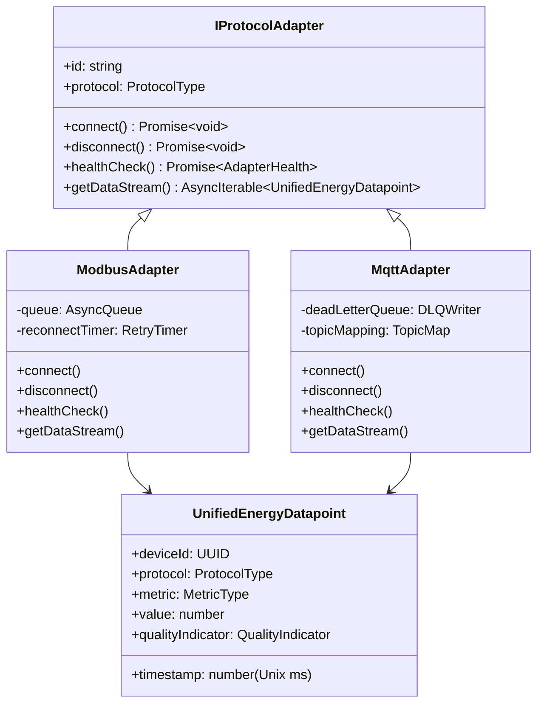

# Architecture Roadmap — Nexus-HEMS-Dash

> **Status:** Active | **Last Updated:** 2026-04-25 | **Horizon:** Q2–Q4 2026

> ADR documents: [`docs/adr/`](adr/) — all architectural decisions with full context, alternatives, and consequences.

This document is the living architecture reference for the Nexus-HEMS-Dash platform. It covers the
full data path from industrial protocol ingestion through TSDB persistence to the React dashboard,
with architecture decision records (ADRs) and a phased implementation roadmap.

---

## System Overview

```mermaid
graph TD
  subgraph Edge["Edge Hardware (Raspberry Pi / Intel NUC)"]
    subgraph Backend["@nexus-hems/api — Express 5"]
      MA[ModbusAdapter<br/>RTU/TCP Read-Only]
      MQTT[MqttAdapter<br/>TLS 1.3 / mTLS]
      EB[EventBus<br/>Node EventEmitter<br/>500 ms batch window]
      TS[TimeseriesService<br/>@influxdata/influxdb-client]
      WAL[WAL Fallback<br/>wal.ndjson]
      ER[EnergyRouterService<br/>aWATTar Day-Ahead LP]
      WS[WebSocket Gateway<br/>Subscription Model]
      HR[History Routes<br/>GET /api/v1/history]
      IDB[(InfluxDB 2.7)]
      AUDIT[(Audit Log<br/>SQLite / InfluxDB)]
    end
    subgraph Frontend["@nexus-hems/web — React 19 Vite SPA"]
      FAdapters[10 Frontend Adapters<br/>5 Core + 5 Contrib]
      ES[useEnergyStore<br/>Zustand — in-memory]
      AS[useAppStore<br/>Zustand + localStorage]
      SANKEY[D3 Sankey<br/>Web Worker layout]
      HC[HistoricalChart<br/>Recharts ComposedChart]
      MPC[MPC Optimizer<br/>LP day-ahead]
      AI[AI Client<br/>7 providers]
    end
  end

  MA -->|UnifiedEnergyDatapoint| EB
  MQTT -->|UnifiedEnergyDatapoint| EB
  EB -->|500 ms batches| TS
  TS -->|WriteAPI| IDB
  TS -->|offline| WAL
  WAL -->|recovery| TS
  EB --> ER
  ER -->|decisions| AUDIT
  ER -->|aWATTar fetch| AWattar[(aWATTar DE API)]
  IDB --> HR
  HR -->|Flux downsampling| WS
  WS -->|filtered metrics| Frontend

  FAdapters -->|UnifiedEnergyModel| ES
  ES --> AS
  AS --> SANKEY
  AS --> HC
  HC -->|TanStack Query| HR
  AS --> MPC
  AS --> AI
```

---

## Architecture Decision Records (ADRs)

| ID | Decision | Chosen | Rationale |
|----|----------|--------|-----------|
| ADR-01 | Linter/Formatter | **Biome 2.4.7** | ~10× faster than ESLint+Prettier; handles TS/JS/JSON/CSS/YAML; single config |
| ADR-02 | Backend Framework | **Express 5** | Already production-hardened (Helmet CSP, JWT, rate limiting); no framework migration overhead |
| ADR-03 | Event Bus | **Node.js EventEmitter + 500 ms buffer** | No RxJS dependency; consistent with project style; sufficient for <1 kHz data rates |
| ADR-04 | Historical Charts | **Recharts ComposedChart** | Already integrated; avoid ~1 MB echarts bundle; Semantic Zoom via API pagination |
| ADR-05 | Tariff API | **aWATTar DE REST** | No API key required; public Day-Ahead prices; already used in frontend |
| ADR-06 | Modbus Access | **Read-Only (Phase 3)** | Safety-first; Command Safety Layer already validates writes; write-support in Phase 3b |
| ADR-07 | Domain Types | **New `domain/` dir in shared-types** | Complementary to `protocol.ts`; shared between api + web; no breaking changes |
| ADR-08 | TSDB | **InfluxDB 2.7** | Already in docker-compose; native Flux downsampling; Prometheus integration |
| ADR-09 | Audit Trail | **InfluxDB `decisions` measurement + SQLite fallback** | InfluxDB for time-series decisions; SQLite (`better-sqlite3`) when InfluxDB unavailable |
| ADR-10 | Container | **Multi-stage Alpine + Edge limits** | Existing Dockerfile extended; CPU/RAM limits critical for Raspberry Pi 4 deployment |
| ADR-11 | Biome-first toolchain | **Biome 2.4.7** | Documented in [`docs/adr/ADR-001-biome-first-toolchain.md`](adr/ADR-001-biome-first-toolchain.md) |
| ADR-12 | Zustand dual-store | **useAppStore + useEnergyStore** | Documented in [`docs/adr/ADR-002-zustand-dual-store-pattern.md`](adr/ADR-002-zustand-dual-store-pattern.md) |
| ADR-13 | JTI revocation | **Optional Redis + in-memory fallback** | Documented in [`docs/adr/ADR-003-jti-revocation-redis-fallback.md`](adr/ADR-003-jti-revocation-redis-fallback.md) |
| ADR-14 | Distroless containers | **gcr.io/distroless (production stage only)** | Documented in [`docs/adr/ADR-004-distroless-docker-production.md`](adr/ADR-004-distroless-docker-production.md) |
| ADR-15 | Dexie downsampling | **Tiered 15m / 1h aggregates** | Documented in [`docs/adr/ADR-005-dexie-tiered-downsampling.md`](adr/ADR-005-dexie-tiered-downsampling.md) |
| ADR-16 | Ring buffer sizing | **Per-adapter adaptive sizes** | Documented in [`docs/adr/ADR-006-ring-buffer-per-adapter-sizing.md`](adr/ADR-006-ring-buffer-per-adapter-sizing.md) |
| ADR-17 | Visual regression | **Chromatic gated in CI** | Documented in [`docs/adr/ADR-007-chromatic-visual-regression-gate.md`](adr/ADR-007-chromatic-visual-regression-gate.md) |
| ADR-18 | PII sanitization | **PII masking + AI output filter** | Documented in [`docs/adr/ADR-008-pii-sanitization-ai-output-filter.md`](adr/ADR-008-pii-sanitization-ai-output-filter.md) |
| ADR-19 | Multi-user RBAC | **ADR only; code deferred v1.2.0** | Documented in [`docs/adr/ADR-009-multi-user-rbac-future.md`](adr/ADR-009-multi-user-rbac-future.md) |
| ADR-20 | OpenADR 3.1.0 placement | **Frontend Contrib Adapter + API OAuth2 proxy** | Documented in [`docs/adr/ADR-012-openadr-ven-client.md`](adr/ADR-012-openadr-ven-client.md) |
| ADR-21 | V2G BPT parameter completeness | **Full ISO 15118-20 Annex D BPT params** | Documented in [`docs/adr/ADR-013-v2g-bpt-parameters.md`](adr/ADR-013-v2g-bpt-parameters.md) |
| ADR-22 | VPP scope | **Single-home VPP-Node for v1.2.0** | Documented in [`docs/adr/ADR-014-vpp-single-home-node.md`](adr/ADR-014-vpp-single-home-node.md) |

---

## Data Flow — Full Stack



---

## Domain Model



---

## Implementation Phases

| Phase | Scope | Status | Key Files |
|-------|-------|--------|-----------|
| **0** | Documentation & Roadmap | ✅ Complete | `docs/Architecture-Roadmap.md`, `docs/Backend-Implementation-Roadmap.md`, `SECURITY.md` (SLA), `CONTRIBUTING.md` (backend guide), `README.md` |
| **1** | Shared Types — Domain Model | ✅ Complete | `packages/shared-types/src/domain/energy.types.ts` |
| **2** | Backend EventBus + TSDB | ✅ Complete | `apps/api/src/core/EventBus.ts`, `apps/api/src/services/TimeseriesService.ts` |
| **3** | Backend Protocol Adapters | ✅ Complete | `apps/api/src/protocols/modbus/ModbusAdapter.ts`, `apps/api/src/protocols/mqtt/MqttAdapter.ts` |
| **4** | WS Subscription + History API | ✅ Complete | `apps/api/src/ws/energy.ws.ts` (subscription), `apps/api/src/routes/history.routes.ts` |
| **5** | EnergyRouterService | ✅ Complete | `apps/api/src/services/EnergyRouterService.ts`, `apps/api/src/data/audit-log.ts` |
| **6** | Frontend HistoricalChart | ✅ Complete | `apps/web/src/components/HistoricalChart.tsx` |
| **7** | Edge Docker Compose | ✅ Complete | `docker-compose.prod.yml`, `.env.prod.example` |
| **8** | CI/Release | ✅ Complete | `.releaserc.json` (already existed), `CHANGELOG.md` |
| **3b** | Modbus Write + Force-Charge | Planned | `apps/api/src/protocols/modbus/ModbusAdapter.ts` write extension |
| **P1** | SBOM/Grype + Distroless | Planned | `.github/workflows/sbom-scan.yml`, `Dockerfile`, `Dockerfile.server`, `.renovaterc.json`, `helm/.../namespace.yaml` |
| **P2** | Performance (Dexie + LTTB + Ring) | Planned | `lib/downsampling-service.ts`, `lib/chart-sampling.ts`, `core/useEnergyStore.ts` |
| **P3** | Security (JTI Redis + PII + mTLS) | Planned | `apps/api/src/jwt-utils.ts`, `apps/web/src/lib/db.ts`, `core/aiClient.ts`, `CertificateManagement.tsx` |
| **P4** | Testing (60%→85% coverage) | Planned | `vitest.config.ts`, new unit/fuzz/visual test files |
| **P5** | Features (UPnP + §14a + WCAG AAA) | Planned | `lib/upnp-discovery.ts`, grid operator API, accessibility enhancements |
| **P6** | Community (Log4brains + CLI) | Planned | `log4brains`, `create-nexus-adapter` CLI |
| **9** | OCPP 2.1 Backend Adapter | Planned | `apps/api/src/protocols/ocpp/OcppAdapter.ts` |
| **10** | EEBUS SPINE/SHIP Backend | Planned | `apps/api/src/protocols/eebus/EebusAdapter.ts` |
| **11** | KNX Backend Adapter | Planned | `apps/api/src/protocols/knx/KnxAdapter.ts` |
| **12** | Redis Pub/Sub (cluster mode) | Planned | Replace EventBus for multi-instance deployments |

---

## Technology Stack (Locked)

### Backend (`apps/api`)
| Concern | Technology | Version |
|---------|-----------|---------|
| HTTP Server | Express | 5.x |
| WebSocket | ws | 8.x |
| Auth | jose (JWT) | 6.x |
| Runtime Validation | Zod | 4.x |
| TSDB Client | @influxdata/influxdb-client | 1.x |
| Modbus | modbus-serial | latest |
| Audit Trail | better-sqlite3 | latest |
| Process Execution | tsx | 4.x |

### Frontend (`apps/web`)
| Concern | Technology | Version |
|---------|-----------|---------|
| UI Framework | React | 19 |
| Build | Vite (Rolldown) | 8.x |
| State | Zustand | 5.x |
| Async | TanStack Query | 5.x |
| Charts | Recharts | 3.x |
| Energy Flow | D3.js + d3-sankey | latest |
| Animations | motion (Framer successor) | 12.x |
| Offline | Dexie.js | 4.x |

---

## Security Architecture

All backend changes go through the existing layered security model:

```
Internet/LAN
    │
    ▼
nginx (reverse proxy, limit_conn 50/IP, TLS termination)
    │
    ▼
Express 5 (Helmet CSP, CORS whitelist, rate limiting 100/min global)
    │
    ├── /api/auth/*   → 10 req/min; API key validation
    ├── /api/*        → requireJWT middleware; scope checks
    └── /ws           → WS ticket or Bearer token; 30 cmd/min per client
    │
    ▼
Protocol Adapters (isolated; read-only in Phase 3; write-only via Command Safety Layer)
    │
    ▼
Command Safety Layer (Zod validation, audit trail, danger confirmation)
```

---

## Future Work (Post Phase 8)

- **Phase 3b**: Modbus write access for Force-Charge commands (requires user confirmation dialog)
- **Phase 9**: OCPP 2.1 backend CSMS (Central System Management) — currently only handled in frontend adapter
- **Phase 10**: EEBUS SPINE/SHIP production TLS 1.3 mTLS handshake completion
- **Phase 11**: KNX/IP backbone adapter in backend
- **Phase 12**: Redis Pub/Sub for multi-node Edge cluster deployments
- **OpenSSF Gold**: Achieve all remaining Oro badge criteria (automated release notes ✅, CII Best Practices checklist)
