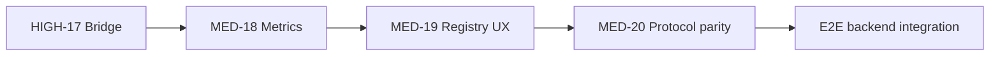

# Nexus-HEMS-Dash — Full-Scale Audit Report (2026-07-02)

**Version:** 2026-07-02 full-scale consolidation  
**Repository baseline:** `main` after PR #197 (HIGH-17 `LiveEnergyAggregator`) + UI campaign PRs #198–#201  
**Shipped release line:** 1.3.0 (2026-06-30)  
**Active work line:** v1.3.x → v1.4.0  
**Method:** Delta audit (`docs/Audit-Report-2026-07-02.md`) + direct file verification + `FEATURE_STATUS.md` cross-check  
**Supersedes:** Informal "full-scale transformation" briefs that assumed Victron-centric runtime and an unwired EventBus

> This document is the **single entry point** for campaign planning. For the original 46-finding
> catalogue see `docs/Audit-Report-2026-06-29.md`. For the July delta methodology see
> `docs/Audit-Report-2026-07-02.md`. For executable agent instructions see
> `docs/Claude-Code-Master-Prompt-v2-Nexus-HEMS-Dash.md`.

---

## Executive summary

Nexus-HEMS-Dash is a **mature, safety-conscious HEMS platform** with exceptional CI depth, 13 real
frontend protocol adapters, and a modular Settings architecture. The June–July 2026 campaign
(closed Critical/High security items, decomposed Settings, hardened a11y/visual layers) left three
**actionable** gaps for v1.4.0:

| ID | Severity | Topic | Status |
|----|----------|-------|--------|
| HIGH-17 | HIGH | EventBus → WebSocket bridge | ✅ **Resolved** (`LiveEnergyAggregator`) |
| MED-18 | MED | Per-adapter Prometheus metrics | ⏳ Scheduled |
| MED-19 | MED | Registry browser + add-adapter wizard | ⏳ Scheduled |
| MED-20 | MED | Backend protocol parity (6 protocols) | ⏳ Scheduled |

**Rejected premise:** "Victron-centric platform needs brand-agnostic rewrite." **Evidence:** runtime
is vendor-neutral; invest in MED-19 UX instead (ADR-019).

---

## 1. Architecture (as-built)

### 1.1 Frontend

- React 19 + Vite 8 + Tailwind v4 + Zustand dual-store.
- 8 primary routes / 7 nav sections; lazy-loaded pages; PWA + optional Tauri/Capacitor.
- 13 `EnergyAdapter` implementations under `apps/web/src/core/adapters/` — all extend `BaseAdapter`
  (circuit breaker, Zod, reconnect, per-adapter client metrics).
- Command path: UI → `command-safety.ts` (Zod, rate limit, IndexedDB audit) → adapter / WS.

### 1.2 Backend

- Express 5 + WebSocket; JWT + scopes; `READ_ONLY_MODE` global command block.
- **Two** `IProtocolAdapter` implementations: Modbus SunSpec poller, Victron MQTT subscriber.
- `EventBus` 500 ms batch buffer → InfluxDB, optimizer, **`LiveEnergyAggregator`**.
- `energy.ws.ts`: live snapshot when mode=live and data fresh; else mock stream.

### 1.3 Shared contracts

- `@nexus-hems/shared-types`: `EnergyData`, `UnifiedEnergyDatapoint`, `WSCommand`, Zod schemas.
- Role-tagged datapoints map to `EnergyData` fields in `LiveEnergyAggregator`.

---

## 2. Adapter maturity

### 2.1 Frontend adapters — all production-grade

| ID | LOC (approx) | Connection | Tier |
|----|--------------|------------|------|
| victron-mqtt | 583 | Browser → Venus OS MQTT/WS | T1 |
| modbus-sunspec | 521 | Browser → REST / API proxy | T1 + T4 |
| ocpp-21 | 691 | Browser → EVSE/CSMS WS | T1 |
| eebus | 892 | Browser → SPINE/SHIP TLS | T1 |
| knx | 450 | Browser → KNXnet/IP | T1 |
| openems | 705 | Browser → JSON-RPC WS | T1 |
| evcc | 450 | Browser → evcc REST+WS | T1 |
| homeassistant-mqtt | 355 | Contrib MQTT | T2 |
| matter-thread | 535 | Contrib Matter | T2 |
| zigbee2mqtt | — | Contrib bridge | T2 |
| shelly-rest | 352 | Contrib REST | T2 |
| openadr-3-1 | 618 | Contrib + API OAuth proxy | T2 + partial T4 |
| example-contrib | 141 | Template | T2 |

### 2.2 Backend adapters

| Protocol | IProtocolAdapter | Zod | DLQ | UI via bridge | Notes |
|----------|------------------|-----|-----|---------------|-------|
| Modbus/SunSpec | ✅ | ✅ | ✅ | ✅ (live) | `device-map.json` |
| Victron MQTT | ✅ | ✅ | ✅ | ✅ (live) | Role-tagged topics |
| KNX | ❌ | — | — | — | T5 planned |
| OCPP CSMS | ❌ | — | — | — | T5 planned |
| EEBUS SPINE stream | ❌ | — | — | — | SHIP service exists; no data adapter |
| evcc | ❌ | — | — | — | T5 planned |
| OpenEMS | ❌ | — | — | — | T5 planned |

### 2.3 Hardware registry (catalog only)

- **113 devices**, **~30 manufacturers**, Victron **7 (~6%)**.
- Query API: `getAllDevices`, `searchDevices`, `getDevicesByManufacturer`, `getDevicesByProtocol`, …
- **Not surfaced in UI** — only unit tests consume it today.

---

## 3. Corrected premises (evidence)

### 3.1 Keystone was backend→UI wiring — now fixed

Before #197, `energy.ws.ts` broadcast mock data in both modes. `LiveEnergyAggregator` now:

1. Subscribes to `EventBus` as `EventBusSubscriber`.
2. Folds `role`+`metric` datapoints into `EnergyData`.
3. Exposes `hasFreshLiveData()` with 30 s window.
4. Integrated in `apps/api/src/index.ts` and passed to `setupWebSocket()`.

**Regression risk:** any change to WS broadcast loop or role mapping must keep mock fallback and
live-mode gating tests green (`live-energy-aggregator.test.ts`, `energy.ws` tests).

### 3.2 Vendor neutrality is architectural, not cosmetic

| Brief claim | Code truth |
|-------------|------------|
| Victron default adapter | `isBuiltinAdapterEnabledByDefault()` → `false` |
| Victron-heavy registry | 6% of catalog |
| Victron-first Settings | Protocol-agnostic tabs; 10 modules post MED-16 |
| Thin competitor adapters | Comparable LOC and `BaseAdapter` depth |

**Action:** MED-19 wizard + registry browser, not adapter rewrites.

---

## 4. Security & safety posture (re-affirmed)

| Control | Status |
|---------|--------|
| Mock default (double opt-in live) | ✅ |
| `READ_ONLY_MODE` (SAF-05) | ✅ v1.3.0 |
| Server-side command audit NDJSON | ✅ |
| JWT scopes + rotation | ✅ |
| Supply chain (Grype, cosign, SLSA) | ✅ in CI |
| BYOK AI keys (AES-GCM IndexedDB) | ✅ |
| WCAG 2.2 AA automation | ✅ axe Playwright |
| Regulatory certification (VDE/IEC) | ❌ not obtained — see Safety notice |

No new **Critical** findings in July delta.

---

## 5. UI/UX campaign status (July 2026)

| Item | Status |
|------|--------|
| Settings decomposition (MED-16) | ✅ 3,663 → 512 LOC |
| Chart token migration (`--chart-*`, `--price-*`) | ✅ |
| a11y deep-dive (focus trap, sr-only tables, target-size) | ✅ |
| Choice-card selectors vs native `<select>` | 🔄 PR #201 |
| PageTour / EmptyState | ⏳ Phase E tail |
| Command feedback toasts | ✅ |

---

## 6. Open work — recommended sequence

1. **MED-18** — Ship with any live-hardware deployment; unblocks ops confidence.
2. **MED-19** — Highest user-visible "multi-vendor" ROI; reuse `hardware-registry.ts`.
3. **MED-20** — One backend protocol per PR (KNX → evcc → OpenEMS → OCPP → EEBUS SPINE).
4. **Testing tail** — Auth, command-safety, backend-integration E2E specs.

---

## 7. Support tier reference

See §4 in `docs/Claude-Code-Master-Prompt-v2-Nexus-HEMS-Dash.md` (T1–T6). Use in UI badges,
docs, and wizard copy — avoid implying any single manufacturer is "default."

---

## 8. Testing & CI

| Gate | Local policy | CI |
|------|--------------|-----|
| type-check | ✅ sequential | ✅ |
| lint (Biome + ESLint) | ✅ sequential | ✅ |
| unit tests | targeted files only | full + coverage |
| E2E Playwright | Chromium only | Chromium + Firefox |
| Lighthouse / size-limit | CI-first | ✅ |
| CodeQL / Scorecard / SBOM | CI-first | ✅ |

Web coverage thresholds (enforced): 70/70/70/70 statements/branches/functions/lines.

---

## 9. Related documents

| Document | Role |
|----------|------|
| `docs/Claude-Code-Master-Prompt-v2-Nexus-HEMS-Dash.md` | Agent plan-mode instructions |
| `docs/Audit-Report-2026-07-02.md` | Delta audit + methodology |
| `docs/Audit-Report-2026-06-29.md` | Original 46-finding catalogue |
| `docs/Technical-Debt-Registry.md` | Canonical tracker |
| `docs/adr/ADR-018-*.md` | Backend-mediated adapters |
| `docs/adr/ADR-019-*.md` | Registry surfacing (not de-biasing) |
| `docs/Campaign-Handoff-2026-07.md` | A–G campaign resume |
| `FEATURE_STATUS.md` | Shipped vs partial matrix |
| `docs/Perfection-Roadmap.md` | Phased milestones |

---

## 10. Quarterly review cadence

Next full audit: **2026-09-29** (per June report). Update this file when:

- A MED-18/19/20 item ships (sync `FEATURE_STATUS.md` + debt registry same PR).
- A new backend protocol lands.
- Adapter tier model changes.

---

*Auditor: Cursor Cloud Agent (consolidation of Claude Code Explore delta, 2026-07-02)*
