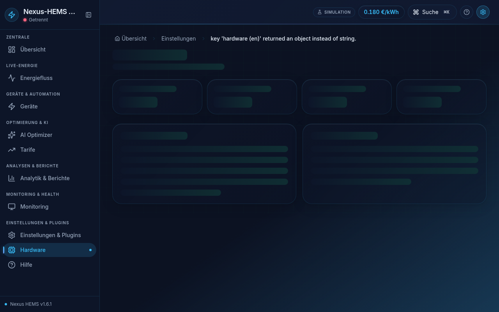

# Heat Pump Integration Guide

> SG Ready, Modbus TCP profiles, and backend `HeatPumpAdapter`.

## Frontend control


*Settings → Hardware → filter heat pump category*

- **Live Energy Flow** / **Devices** — SG Ready mode selector and heat pump power commands use `useSafeCommand` (confirmation for dangerous setpoints).
- KNX floorplan may expose room/setpoint actuators separately.

## Backend HeatPumpAdapter

Enable on the edge API (Raspberry Pi / NUC with LAN access to the heat pump gateway):

```bash
ADAPTER_MODE=live
ALLOW_LIVE_HARDWARE=true
HEATPUMP_MANUFACTURER=viessmann   # stiebel | viessmann | wolf | nibe | alpha | daikin | generic
HEATPUMP_HOST=192.168.1.60
HEATPUMP_PORT=4000                # optional — manufacturer default
HEATPUMP_UNIT_ID=1
HEATPUMP_POLL_MS=10000
```

### Manufacturer profiles

| Manufacturer | Default port | Power register type |
|--------------|--------------|---------------------|
| Stiebel Eltron | 502 | INT16 |
| Viessmann Vitocal | 4000 | UINT16 |
| Wolf ISM7i | 502 | UINT16 |
| NIBE Modbus 40 | 502 | UINT16 (10 W scale) |
| Alpha-InnoTec / Luxtronik | 8000 | UINT16 |
| Daikin Altherma | 502 | UINT16 |

Override registers via `registerOverrides` when using `generic`.

## SG Ready mapping

Backend maps SG Ready state register → synthetic `POWER_W` datapoint:

| Mode | Meaning | Typical power |
|------|---------|---------------|
| 1 | Blocked (grid lockout) | 0 W |
| 2 | Normal | ~70% rated |
| 3 | Recommended increase | ~90% rated |
| 4 | Forced maximum | 100% rated |

## Resilience (v1.6.1+)

- TCP connect failures throw cleanly (no orphan timers).
- Five consecutive poll errors trigger reconnect with single scheduled timer.
- UINT16 vs INT16 respected per manufacturer profile.

## Verification

```bash
pnpm --filter @nexus-hems/api exec vitest run src/protocols/heatpump/HeatPumpAdapter.test.ts
curl http://localhost:3000/api/health
```

## Troubleshooting

| Symptom | Action |
|---------|--------|
| All zeros | Wrong `HEATPUMP_MANUFACTURER` or register map |
| Negative power on Viessmann | Fixed in v1.6.1 — ensure UINT16 profile |
| Reconnect storm | Check gateway max connections; increase `HEATPUMP_POLL_MS` |

See: `docs/Safety-Certification-Notice.md` before live SG Ready switching.
