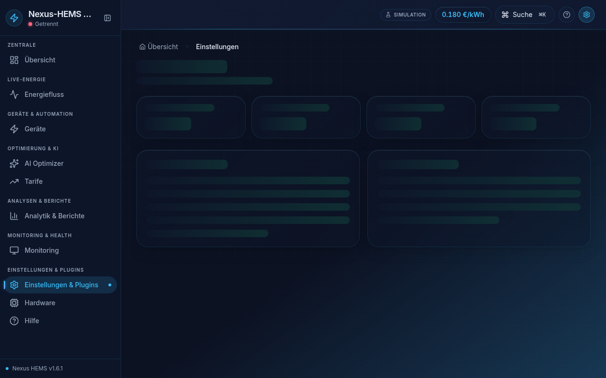

# Operator Screenshots — Capture Guide

> Operator PNGs for integration guides (P3-01). Assets live under `docs/images/operators/` and are embedded from the guides listed below.

---

## Directory layout

```
docs/images/operators/
  ha-ws-api-settings.png      # Settings → Adapters → HA contrib card
  ha-mqtt-broker.png          # MQTT broker / contrib adapters
  eebus-certificates.png      # Settings → EEBUS certificates tab
  eebus-pairing-wizard.png    # Import certificate dialog
  heatpump-modbus-settings.png
  wallbox-evcc-link.png
  mppt-modbus-live.png
  grafana-adapter-health.png  # Monitoring → Adapter Health (Grafana equivalent)
```

---

## Regenerating screenshots

```bash
VITE_E2E_TESTING=true pnpm --filter @nexus-hems/web build
pnpm --filter @nexus-hems/web capture:operators
```

Capture settings: **1280×800**, **ocean-dark** theme, English UI. Script: `apps/web/scripts/capture-operator-screenshots.mjs`.

---

## Capture checklist

| Guide | Screen | Steps |
|-------|--------|-------|
| [Home Assistant](Home-Assistant-Integration-Guide.md) | HA adapter settings | Settings → Adapters → load contrib → Home Assistant card |
| [EEBUS](EEBUS-Integration-Guide.md) | Certificates tab | Settings → tab=certificates → trust store visible |
| [Heat Pump](Heat-Pump-Integration-Guide.md) | Modbus host | Settings → Hardware → heatpump category |
| [Wallbox](Wallbox-EV-Charging-Guide.md) | evcc / OCPP panel | Devices → EV section |
| [MPPT](MPPT-Hybrid-Inverter-Guide.md) | Live energy PV | Energy Flow → Sankey |
| [Grafana](Grafana-Dashboards-Custom.md) | Adapter Health | Monitoring → Adapter Health (in-app; Grafana `nexus-hems-adapters`) |

---

## Markdown embed pattern

```markdown

*Settings → EEBUS → Import Certificate (ocean-dark theme, v1.6.1)*
```

Use **German and English** captions in `de`/`en` guide sections when screenshots contain UI text.

---

## Automation notes

- Playwright `toHaveScreenshot()` for Settings sub-routes — `apps/web/tests/e2e/__screenshots__/`
- Chromatic for component-level captures — not a substitute for full-page operator flows
- CI does not regenerate PNGs on every run; re-run `capture:operators` when Settings UI changes materially
