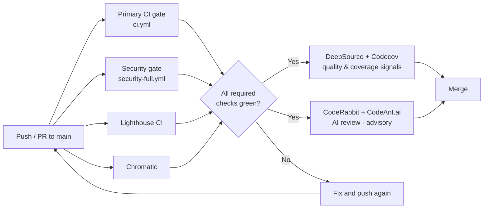

# PR Feedback Playbook — Nexus-HEMS-Dash

**Purpose:** Help contributors understand, act on, and escalate the feedback they receive in pull requests.

**Audience:** Anyone opening or reviewing a PR in `qnbs/Nexus-HEMS-Dash`.

**Last updated:** 2026-06-28

---

## 1. Philosophy

PR feedback in this project is designed to be:

- **Fast** — security and quality checks run before heavy E2E/visual jobs.
- **Actionable** — every comment should tell you what is wrong, why it matters, and how to fix it.
- **Educational** — checks link to runbooks so you learn the system while fixing it.
- **Safe** — feedback never auto-applies changes to device-control, auth, or safety-critical code.

If a check ever feels noisy or unhelpful, open an issue or suppress it responsibly (see §6).

---

## 2. PR Feedback Flow



---

## 3. Tool Roles

| Tool                    | What it owns                                                           | Blocking?                                                                                                | Learn more                                                                                         |
| ----------------------- | ---------------------------------------------------------------------- | -------------------------------------------------------------------------------------------------------- | -------------------------------------------------------------------------------------------------- |
| **Biome**               | Lint, format, import sorting, a11y, performance rules                  | Yes (via `pnpm lint` in CI)                                                                              | [Toolchain Architecture](Toolchain-Architecture.md)                                                |
| **ESLint (React-only)** | React Compiler, hooks, refresh rules                                   | Yes (via `pnpm lint` in CI)                                                                              | [Toolchain Architecture](Toolchain-Architecture.md)                                                |
| **TypeScript**          | Strict type checking                                                   | Yes (via `pnpm type-check` in CI)                                                                        | [Toolchain Architecture](Toolchain-Architecture.md)                                                |
| **DeepSource**          | Static analysis, secrets, Docker, coverage diff                        | Advisory initially; `DeepSource: JavaScript` and `DeepSource: Secrets` will become required after tuning | [runbooks/deepsource-integration.md](runbooks/deepsource-integration.md)                           |
| **Codecov**             | Coverage %, patch/project delta vs base (flags: web, api)              | Advisory (`informational`); the blocking floor is `check-coverage-baseline.mjs` (PRF-03)                 | [runbooks/working-with-coverage.md](runbooks/working-with-coverage.md)                             |
| **CodeRabbit**          | AI contextual review — logic, architecture, missing tests, domain risk | Advisory                                                                                                 | [runbooks/coderabbit-integration.md](runbooks/coderabbit-integration.md)                           |
| **CodeAnt.ai**          | AI-powered architectural, maintainability, and security-smell feedback | Advisory                                                                                                 | [runbooks/codeant-ai-integration.md](runbooks/codeant-ai-integration.md)                           |
| **Lighthouse CI**       | Performance, accessibility, best-practices, PWA budgets                | Yes                                                                                                      | [runbooks/lighthouse-ci.md](runbooks/lighthouse-ci.md) (planned)                                   |
| **Chromatic**           | Visual regression via Storybook                                        | Yes (if token configured)                                                                                | [adr/ADR-007-chromatic-visual-regression-gate.md](adr/ADR-007-chromatic-visual-regression-gate.md) |

---

## 4. The Correction Loop

When a check fails, follow this loop:

1. **Find the failure.**
   - Open the PR checks tab.
   - Click the failing check name.
   - Read the job log or inline annotation.

2. **Match it to a runbook.**
   - CI-related failure → `docs/runbooks/ci-primary-gate.md`
   - Security-related failure → `docs/runbooks/security-full-gate.md`
   - DeepSource annotation → `docs/runbooks/deepsource-integration.md`
   - CodeAnt comment → `docs/runbooks/codeant-ai-integration.md`
   - Coverage drop → `docs/runbooks/working-with-coverage.md`

3. **Fix locally.**
   - Prefer `pnpm lint:fix` and `pnpm format` for Biome/ESLint issues.
   - For TypeScript errors, run `pnpm type-check`.
   - For test failures, run the relevant `pnpm test:run` / `pnpm test:e2e` subset.
   - For DeepSource issues, see the suppression rules in §6.

4. **Push and verify.**
   - Push the fix.
   - Wait for the relevant checks to re-run.
   - Resolve any review threads.

5. **Escalate if stuck.**
   - If a check seems genuinely wrong or noisy, open a draft comment on the PR or an issue.
   - For safety-critical disagreements, tag `@qnbs`.

---

## 5. Autofix Policy

### What can be auto-fixed

- Formatting, import sorting, unused imports.
- Simple style issues that do not change behavior.

### What must NEVER be auto-fixed

- Changes to control logic, auth, rate limiting, or safety guardrails.
- Files under:
  - `apps/api/src/middleware/security.ts`
  - `apps/api/src/routes/auth*.ts`
  - `apps/api/src/protocols/**`
  - `apps/web/src/core/adapters/**`
  - `apps/web/src/core/command-safety.ts`
  - `apps/web/src/core/energy-controllers.ts`

### How autofix is applied

DeepSource Autofix creates a separate PR/branch when enabled. It never commits directly to a PR branch without explicit maintainer action.

---

## 6. Suppressing Issues Responsibly

### DeepSource

Use an explicit `skipcq` comment with the rule code:

```ts
// Good: explicit rule code, plus a reason
const legacy = JSON.parse(raw); // skipcq: JS-0323 — legacy import path, will be replaced in MED-04
```

Avoid bare `// skipcq` because it silences all rules on that line.

For repository-wide suppressions, prefer updating `.deepsource.toml` `exclude_patterns` or the DeepSource dashboard ignore rules, and document the rationale in the PR description.

### Biome

Use a targeted suppression comment:

```ts
// biome-ignore lint/security/noDangerouslySetInnerHtml: sanitized by DOMPurify before insertion
```

### CodeAnt.ai

If a CodeAnt suggestion is incorrect or unsafe, reply to the thread explaining why and mark it resolved. Do not blindly apply AI suggestions to control logic.

---

## 7. Energy-Domain Safety Reminders

- **Never** lower validation, rate limits, or command guardrails to satisfy a linter or AI reviewer.
- **Always** add tests when changing adapter, controller, or security code.
- **Preview/staging builds** must default to `ADAPTER_MODE=mock` with a safety banner and `X-Robots-Tag: noindex`.
- When in doubt, ask for human review.

---

## 8. Quick Reference: Check Names

These are the status checks you will see on a PR:

| Check                       | Meaning                                                                          |
| --------------------------- | -------------------------------------------------------------------------------- |
| `✅ CI Passed`              | Rollup gate for lint, typecheck, unit tests, build, E2E, Storybook, deploy.      |
| `Security Gate`             | Rollup gate for CodeQL, Gitleaks, Semgrep, anti-trojan-source, dependency audit. |
| `DeepSource: JavaScript`    | Static-analysis report card (advisory initially).                                |
| `DeepSource: Secrets`       | Secret-scanning report (advisory initially).                                     |
| `DeepSource: Test coverage` | Coverage diff for the PR (advisory initially).                                   |
| `CodeAnt AI`                | AI review summary (advisory).                                                    |
| `Lighthouse CI`             | Performance / a11y / best-practices score gate.                                  |
| `chromatic`                 | Visual regression gate.                                                          |
| `Security Fuzz Tests`       | Property-based security fuzz gate.                                               |

---

## 9. Related Runbooks

- [runbooks/ci-primary-gate.md](runbooks/ci-primary-gate.md)
- [runbooks/security-full-gate.md](runbooks/security-full-gate.md)
- [runbooks/deepsource-integration.md](runbooks/deepsource-integration.md)
- [runbooks/codeant-ai-integration.md](runbooks/codeant-ai-integration.md)
- [runbooks/pr-status-checks.md](runbooks/pr-status-checks.md)
- [runbooks/working-with-coverage.md](runbooks/working-with-coverage.md)
