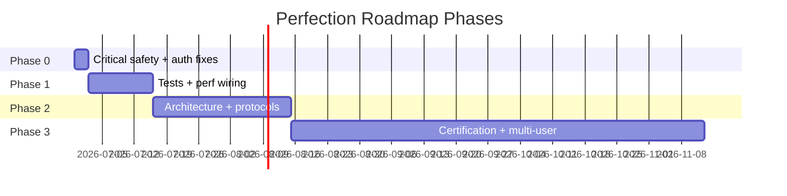

# Perfection Roadmap — Nexus-HEMS-Dash

> **Status:** Active living document  
> **Created:** 2026-06-29  
> **Source audit:** `docs/Audit-Report-2026-06-29.md`  
> **Baseline:** v1.2.0 shipped · v1.3.0 in flight  
> **Owner:** @qnbs + contributors

This roadmap translates the June 2026 deep audit into **phased, measurable milestones** with success metrics and rollback strategies. It supersedes tactical items in `docs/Master-Improvement-Roadmap.md` where they conflict; the Master Roadmap remains the historical v1.1→1.2 record.

---

## Guiding Principles

1. **Safety first** — never weaken command caps, circuit breakers, or mock defaults without explicit review.
2. **Minimal surgical diffs** — prefer focused PRs over sweeping refactors.
3. **Cloud-first verification** — heavy gates (full test suite, E2E matrix, Lighthouse) run in CI.
4. **Truth-sync docs** — every shipped change updates roadmaps and debt registry the same sprint.
5. **Measurable outcomes** — each milestone has numeric success criteria.

---

## Phase Overview



| Phase | Horizon | Focus | Success metric |
|-------|---------|-------|----------------|
| **0 — Immediate** | 1–3 days | Safety defaults, auth wiring, doc truth-sync | 0 Critical findings open |
| **1 — Short-term** | 1–2 sprints | Test coverage, perf instrumentation, supply chain | Web coverage ≥60%; Grype gate active |
| **2 — Medium-term** | 1–2 months | Protocol security, architecture, scale prep | OCPP Profile 3 operational; adapter worker wired |
| **3 — Long-term** | v1.4+ | RBAC, certification support, flex markets | RBAC ADR implemented; DPIA complete |

---

## Phase 0 — Immediate (Critical Safety + Security)

**Goal:** Eliminate deployment foot-guns and restore production auth paths.  
**Rollback:** All changes env-gated; `ADAPTER_MODE=live` preserves legacy default during transition window.

### Milestone 0.1 — Safe hardware defaults

| Task | Files | Owner | Status |
|------|-------|-------|--------|
| Change `ADAPTER_MODE` default to `mock` | `apps/api/src/config/adapter-mode.ts` | api | ✅ #128 |
| Align `README.md`, `SECURITY.md`, `Deployment-Guide.md` | docs | docs | ✅ #129 |
| Ship `device-map.json` as empty array; example in `device-map.example.json` | `apps/api/src/data/` | api | ✅ |
| Add startup warning when `live` + non-empty device map | `protocols/index.ts` | api | ✅ |

**Success criteria:**
- Fresh `pnpm dev` never opens Modbus sockets without explicit `ADAPTER_MODE=live`
- `Safety-Certification-Notice.md` and code agree on default

**Tests:** `apps/api/src/protocols/index.test.ts` — mock default, live opt-in.

---

### Milestone 0.2 — Auth token persistence

| Task | Files | Owner | Status |
|------|-------|-------|--------|
| Create `apps/web/src/lib/auth-token.ts` — get/set/clear with expiry | new | web | ✅ |
| Write token after successful `/api/auth/token` response | `ApiAuthSettingsSection.tsx` | web | ✅ |
| Wire Bearer into `CertificateManagement.tsx` fetches | web | web | ✅ #129 |
| Wire Bearer into `EEBUSAdapter.ts` API calls | web | web | ✅ |
| Verify `background-sync.ts` + `sharing.ts` with integration test | tests | web | ✅ |

**Success criteria:**
- `localStorage.getItem('nexus-hems-auth-token')` populated after login
- EEBUS trust UI works against production API (401 → 200)

**Tests:** `auth-token.test.ts`, extend `shares.routes.test.ts` client path.

---

### Milestone 0.3 — WebSocket scope hardening

| Task | Files | Owner | Status |
|------|-------|-------|--------|
| Map all `WSCommandTypeSchema` write commands to `readwrite` or `admin` | `ws-scope.ts` | api | ✅ #130 |
| Add Vitest matrix: each command type × scope → pass/fail | `ws-scope.test.ts` | api | ✅ #130 |
| Document scope matrix in `docs/Security-Architecture.md` | docs | docs | ✅ #129 |

**Success criteria:** 100% write commands require `readwrite` minimum; grid limit requires `admin`.

---

### Milestone 0.4 — Documentation truth-sync (supply chain)

| Task | Files | Owner | Status |
|------|-------|-------|--------|
| Add Grype scan to `sbom-scan.yml` OR remove Grype claims from docs | CI + docs | ci | ⚠️ Partial #130 |
| Correct cosign references (container publish workflow vs Pages deploy) | `SECURITY.md`, `CHANGELOG.md` | docs | ✅ #129 |
| Update `Performance-Optimization-Plan.md` LTTB scope table | docs | docs | ⏳ |

**Success criteria:** Every security claim in README traceable to a workflow file.

---

## Phase 1 — Short-term (Tests + Performance + Supply Chain)

**Goal:** Close safety-critical test gaps; wire existing perf infrastructure; enforce API coverage.

### Milestone 1.1 — Safety-critical test coverage

| Priority | Test target | File to create/extend |
|----------|-------------|----------------------|
| P0 | `EvccAdapter` (REST + WS) | `evcc-adapter.test.ts` | ✅ |
| P0 | `logCommandAudit` + cleanup | `command-safety.test.ts` | ✅ |
| P1 | All `validateCommand` schema types | extend `send-command.test.ts` |
| P1 | `useSafeCommand` / `EmergencyStop` | `command-safety-ui.test.tsx` |
| P2 | `ModbusSunSpecAdapter` integration | `modbus-sunspec-adapter.test.ts` |
| P2 | API WS gateway integration | extend `energy-ws.test.ts` |

**Success criteria:**
- Web coverage thresholds raised to **60%** statements / **50%** branches
- API coverage enforced in `ci.yml` with `--coverage`
- Zero Critical/High test gaps from audit matrix

---

### Milestone 1.2 — Performance wiring

| Task | Impact | Files |
|------|--------|-------|
| Wire `useAdapterWorker` into Modbus + Shelly adapters | Main-thread relief | adapters, `useAdapterWorker.ts` |
| Throttle `bridgeToAppStore` + `persistSnapshot` to 250 ms | Scale headroom | `useEnergyStore.ts` |
| Add `performance.mark()` around `mergeData` (dev only) | Observability | `useEnergyStore.ts` |
| Reconcile Performance Plan scope table | Doc accuracy | `Performance-Optimization-Plan.md` |

**Success criteria:**
- `mergeData` p95 < 50 ms in perf-benchmark workflow (new probe)
- Adapter worker used by ≥2 polling adapters

---

### Milestone 1.3 — CI gate consolidation

| Task | Files |
|------|-------|
| Add `fuzz.yml` + `lighthouse.yml` to branch protection required checks | GitHub settings + docs |
| Codecov upload in `ci.yml` (optional token) | `.github/workflows/ci.yml` |
| Reduce A11y E2E waits from 240s → 60s after stabilization | `accessibility.spec.ts` | ✅ |

**Success criteria:** Single "all green" definition covers fuzz + lighthouse on `main`.

---

## Phase 2 — Medium-term (Architecture + Protocol Security)

### Milestone 2.1 — OCPP Security Profile 3

| Task | Files | Status |
|------|-------|--------|
| Load client cert/key from `secure-store` in `OCPP21Adapter._connect()` | `OCPP21Adapter.ts`, `secure-store.ts` | ✅ |
| Basic Auth for Profile 1/2 (URL-embedded) | `ocpp-security.ts` | ✅ |
| CRL/OCSP validation hook (configurable) | `ocpp-security.ts`, `adapter-config-schemas.ts` | ✅ CRL hook; OCSP via API proxy later |
| UI in `CertificateManagement.tsx` for OCPP certs | `CertificateManagement.tsx` | ✅ link to adapter vault |
| Tests with mock CSMS | `ocpp-security.test.ts`, `OCPP21Adapter.test.ts` | ✅ |

**Remaining:** Browser mTLS presentation (API proxy or Tauri); live CSMS integration test.

**Success criteria:** Profile 3 validates credentials and connects over wss; Profile 1/2 use Basic Auth; Profile 0 unchanged.

---

### Milestone 2.2 — EEBUS end-to-end security

| Task | Reference | Status |
|------|-----------|--------|
| Remove auto-PIN in `EEBUSAdapter` | audit SEC-03 | ✅ Done |
| Route browser EEBUS through API WebSocket proxy (`/ws/eebus`) | `eebus-proxy.ws.ts` | ✅ Done |
| Cert rotation documentation + UI workflow | `EEBUS-Certificate-Setup.md`, trust store PIN polling | ⚠️ Partial |
| OCSP/CRL configuration surface (admin) | `GET/PUT /api/eebus/tls/revocation`, `CertificateManagement` | ✅ Done |

**Success criteria:** EEBUS pairing requires user PIN; mTLS terminated server-side; browser uses API proxy — **met** (integration test backlog: live device).

---

### Milestone 2.3 — Architecture refinements

| Task | Rationale | Status |
|------|-----------|--------|
| Split `Settings.tsx` into tab modules | ARCH-01 / MED-16 | ✅ Done — 3,663 → 512 LOC; 10 tabs in `components/settings/*`; 21 unit tests |
| Wire adapter Web-Worker (`useAdapterWorker`) | MED-12 | 🔶 Infra ready; activation safety-gated (see debt registry); SSRF normalization unit-tested |
| Add `targetAdapterId` to `sendAdapterCommand` | ARCH-03 | ✅ |
| Register Evcc/OpenEMS in builtin registry or mark `@experimental` | ARCH-04 | ⏳ Backlog |
| Introduce `useDeviceStore` for per-device state | PERF-05 | ⏳ Backlog |
| Move MPC to `ai-worker.ts` | PERF-03 | ⏳ Backlog |

**Success criteria:** Settings.tsx < 800 lines per module ✅ (nav shell 512 LOC, no tab module > ~950 LOC and dropping); device list supports 50+ entries without UI jank.

---

### Milestone 2.4 — Scalability prep (50–100 devices)

| Task | Approach |
|------|----------|
| Parallel Shelly polling with concurrency limit | `p-limit` or worker batch |
| Configurable EventBus buffer + drop metrics | `EventBus.ts` |
| Virtualized device list in Monitoring | extend existing `@tanstack/react-virtual` |
| Sankey topology config (optional extra nodes) | ADR if >6 nodes |

**Success criteria:** Synthetic benchmark with 100 mock adapters: UI remains interactive (TBT < 400 ms).

---

## Phase 3 — Long-term (Future-proofing)

### Milestone 3.1 — Multi-user RBAC (ADR-009)

| Capability | Scope |
|------------|-------|
| Role hierarchy: viewer → operator → admin | API + UI |
| Per-adapter command permissions | `command-safety.ts` |
| Audit log per user principal | IndexedDB + API export |
| Keycloak integration hardening | existing provider |

**Success criteria:** Two users with different roles cannot escalate via UI or WS.

---

### Milestone 3.2 — Certification support package

| Deliverable | Purpose |
|-------------|---------|
| FMEA template per adapter domain | VDE pre-audit |
| Traceability matrix (req → test → code) | IEC 61508 prep |
| Formal DPIA | GDPR Art. 35 |
| Read-only deployment mode | Operator safety |
| Incident response runbook | Post-deployment |

**Success criteria:** External auditor can review package without code access.

---

### Milestone 3.3 — Advanced energy markets

| Feature | Reference |
|---------|-----------|
| Multi-home VPP aggregation | `vpp-service.ts` extension |
| OpenADR flex bid automation | `VPP-FlexMarket-Guide.md` |
| Nordpool + grid fee optimizer integration | `optimizer.ts` |
| Matter↔OpenADR UC 2.6.3 dispatch | `uc26-translator.ts` |

**Success criteria:** Flex offer submitted to mock VTN; revenue tracked in UI.

---

## Success Metrics Dashboard

| Metric | Current (Jun 2026) | Phase 1 target | Phase 3 target |
|--------|-------------------|----------------|----------------|
| Critical audit findings | 2 | 0 | 0 |
| Web test coverage (statements) | 52% | 60% | 75% |
| API test coverage (statements) | 55% (unenforced) | 60% (enforced) | 70% |
| WCAG 2.2 AA compliance | ~88% | 92% | 95% |
| Lighthouse performance | ≥85% | ≥85% | ≥90% |
| Bundle total JS (gzip) | ≤1100 kB | ≤1100 kB | ≤1000 kB |
| Open Critical CVEs (prod) | 0 | 0 | 0 |
| Grype container gate | ❌ | ✅ | ✅ |

---

## Rollback Playbook

| Milestone | Rollback procedure |
|-----------|-------------------|
| 0.1 mock default | Set `ADAPTER_MODE=live` in env / compose |
| 0.2 auth token | Remove `auth-token.ts`; revert to dev-only auth bypass |
| 0.3 WS scopes | Deploy previous `SCOPE_COMMAND_MAP`; log-only mode first |
| 1.2 perf throttle | `VITE_BRIDGE_THROTTLE_MS=0` |
| 2.1 OCPP Profile 3 | `securityProfile: 1` config fallback |
| 2.3 device store | Feature flag `VITE_DEVICE_STORE=false` |

---

## PR & Commit Conventions (Enhancements)

### Suggested PR template additions

```markdown
## Audit traceability
- [ ] Finding ID(s) addressed: e.g. SEC-01, TEST-01
- [ ] `docs/Technical-Debt-Registry.md` updated
- [ ] No new Critical/High security regressions

## Safety checklist (hardware-touching PRs only)
- [ ] `ADAPTER_MODE=mock` verified in CI
- [ ] Command safety tests updated
- [ ] Rate limits unchanged or documented
```

### Commit scope additions (for `commitlint.config.js`)

Consider adding: `audit`, `safety`, `perf-probe`, `supply-chain` — audit `git log` usage before enabling (LOW-06).

---

## Document Maintenance

| Trigger | Action |
|---------|--------|
| Each sprint end | Update milestone status columns |
| Each minor release | Re-run audit; archive previous `Audit-Report-YYYY-MM-DD.md` |
| Security incident | Add hotfix milestone to Phase 0 |
| CI workflow change | Truth-sync `Security-Roadmap-2026.md` same PR |

---

## Cross-references

- **Full findings:** `docs/Audit-Report-2026-06-29.md`
- **Debt tracker:** `docs/Technical-Debt-Registry.md`
- **Security planning:** `docs/Security-Roadmap-2026.md`
- **Performance planning:** `docs/Performance-Optimization-Plan.md`
- **Historical roadmap:** `docs/Master-Improvement-Roadmap.md`
- **Knowledge-graph practice:** `docs/adr/ADR-017-knowledge-graph-self-reflection.md` — Graphify (`graphify-out/`, `graphify.yml`) + Codegraph MCP are a standing self-reflection layer for architecture/control-path/blast-radius review; artifacts committed, cache git-ignored.

---

*Last updated: 2026-07-01 · Next review: end of Phase 0 (target 2026-07-02)*
