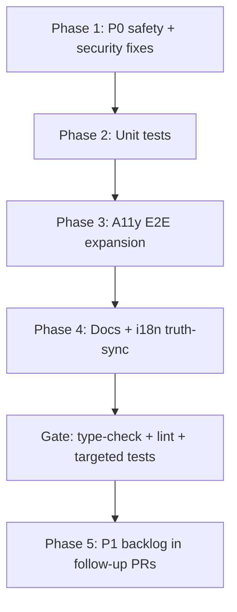

# Post-Implementation Hardening Plan v6.0

**Date:** 2026-07-02  
**Scope:** Verification, hardening, accessibility, testing, and documentation after EEBUS, Home Assistant, PV/MPPT, Wallbox, Heat Pump, and adapter-platform expansions.  
**Baseline release:** v1.6.1

---

## 1. Executive Summary of Findings

| Area | Status (this PR) | Residual risk |
|------|------------------|---------------|
| **Command safety** | `LiveEnergyFlow` + `DevicesAutomation` now route legacy controls through `useSafeCommand` (confirmation + audit) | Other pages should be audited for direct `sendAdapterCommand` usage |
| **Shelly webhook SSRF** | Private-IP source guard enforced in `shelly-webhook.routes.ts` | Per-device host allowlist not yet wired (JWT still required) |
| **HeatPump backend adapter** | connect try/catch, UINT16 power reads, reconnect timer cleanup | Live Modbus hardware validation still manual |
| **HA WebSocket API** | `auth_required` without `haToken` now hard-fails | mTLS to HA not supported (HA uses token auth) |
| **Help / i18n drift** | Updated to v1.6.1, 14 adapters; About tech stack fully i18n | None in About tab |
| **A11y E2E** | Added `/settings/hardware`, `/settings/ai`, `/plugins`; EEBUS certificates axe in `eebus-pairing.spec.ts` | Full pairing wizard flow still manual |
| **Unit tests** | HeatPump, Shelly webhook, ExecService, HA ws-api auth | EEBUS SHIP/mTLS integration tests still thin |
| **Operator guides** | HA guide updated; MPPT/Heat Pump/Wallbox/EEBUS guides added | Full certification runbooks remain out of scope |

---

## 2. Prioritized Task List

### P0 — Critical (addressed in this branch)

| ID | Task | Files | Verification |
|----|------|-------|--------------|
| P0-01 | Legacy sendCommand → useSafeCommand | `useLegacySendCommand.ts`, `LiveEnergyFlow.tsx`, `DevicesAutomation.tsx` | `use-safe-command.test.tsx`, manual danger-command confirm |
| P0-02 | Shelly webhook IP guard | `shelly-webhook.routes.ts` | `shelly-webhook.routes.test.ts` |
| P0-03 | HeatPump connect/reconnect/readRegister | `HeatPumpAdapter.ts` | `HeatPumpAdapter.test.ts` |
| P0-04 | HA ws-api token required | `homeassistant-mqtt.ts` | `homeassistant-mqtt-adapter.test.ts` |
| P0-05 | Help i18n truth-sync | `en.ts`, `de.ts` | Visual check Help → About |
| P0-06 | A11y routes expansion | `accessibility.spec.ts` | `pnpm test:a11y` (CI) |

### P1 — High (next sprint)

| ID | Task | Rationale |
|----|------|-----------|
| P1-01 | EEBUS pairing E2E | ✅ Certificates tab keyboard + axe (`eebus-pairing.spec.ts`) |
| P1-02 | `Help.tsx` hardcoded version strings | ✅ About tech stack → i18n keys |
| P1-03 | EEBUS mTLS empty-cert rejection | ✅ Shipped #217 |
| P1-04 | Per-adapter reconnect metrics dashboards | ✅ `nexus-adapter-health.json` |
| P1-05 | Coverage thresholds staging | ✅ API gates **55/46/62/55** (statements 55% target met) |
| P2-01 | Integration tests: LiveEnergyAggregator + multi-adapter | ✅ `live-energy-eventbus.integration.test.ts` |

### P2 — Medium

| ID | Task |
|----|------|
| P2-01 | Integration tests: LiveEnergyAggregator + multi-adapter | ✅ EventBus + multi-protocol fold |
| P2-02 | Flaky animation a11y stabilization (already mitigated via reduced-motion in E2E) |
| P2-03 | README adapter count 13 → 14 alignment | ✅ 7 core + 7 contrib |
| P2-04 | `accessibility-aaa.spec.ts` doc references → point to `accessibility.spec.ts` only | ✅ Fixed in #217 |

### P3 — Polish

| ID | Task |
|----|------|
| P3-01 | Operator guide screenshots | ✅ PNGs in `docs/images/operators/` + `capture:operators` script |
| P3-02 | ADR for HA dual-mode (ha-ws-api vs mqtt-broker) | ✅ ADR-023 |
| P3-03 | Lighthouse budget re-baseline after Sankey data growth | ✅ `docs/Lighthouse-Baseline-2026-07.md` |

---

## 3. Detailed Plan per Area

### 3.1 Code quality & stability

**HeatPumpAdapter** (`apps/api/src/protocols/heatpump/HeatPumpAdapter.ts`):

- `connect()` wraps TCP in try/catch and resets client on failure.
- `readRegister(addr, dataType)` respects `UINT16` vs `INT16` for power registers (Viessmann/NIBE profiles).
- `scheduleReconnect()` uses a single tracked timer; `disconnect()` clears it.

**Verification:** `pnpm --filter @nexus-hems/api exec vitest run src/protocols/heatpump/HeatPumpAdapter.test.ts`

### 3.2 Security

**Shelly webhook** — rejects non-private `req.ip` before parsing body (SSRF guard). JWT + `readwrite` scope still required.

**HA WebSocket** — anonymous `auth_required` continuation removed; operators must configure a Long-Lived Access Token.

**ExecService** — whitelist + argv-only spawn unchanged; tests added for rejection paths.

### 3.3 Accessibility

Extended axe Playwright coverage to Settings sub-routes and Plugins marketplace. Existing mitigations retained:

- `prefers-reduced-motion: reduce` in E2E
- Theme token gate before axe scan
- Animation settle via `document.getAnimations()`

Manual checklist: `docs/Accessibility-Testing-Guide.md`

### 3.4 Testing

| New / updated test file | Coverage |
|-------------------------|----------|
| `HeatPumpAdapter.test.ts` | connect, UINT16/INT16 power, reconnect cleanup |
| `shelly-webhook.routes.test.ts` | private vs public IP |
| `ExecService.test.ts` | whitelist + arg validation |
| `homeassistant-mqtt-adapter.test.ts` | ha-ws-api auth_required |
| `EventBus.test.ts` | buffer, flush, backpressure, subscriber errors |
| `live-energy-eventbus.integration.test.ts` | multi-adapter EventBus → aggregator fold |
| `exec.routes.test.ts` / `metrics.routes.test.ts` | JWT scope gates |
| `grafana.routes.test.ts` / `history.routes.test.ts` | dashboard JSON + history validation |

### 3.5 Documentation

| Guide | Path |
|-------|------|
| Home Assistant (dual mode) | `docs/Home-Assistant-Integration-Guide.md` |
| EEBUS | `docs/EEBUS-Integration-Guide.md` |
| MPPT / hybrid inverter | `docs/MPPT-Hybrid-Inverter-Guide.md` |
| Wallbox / EV | `docs/Wallbox-EV-Charging-Guide.md` |
| Heat pump | `docs/Heat-Pump-Integration-Guide.md` |

---

## 4. Phased Execution Order

**Gate criteria before merge:**

1. `pnpm type-check` — clean
2. `pnpm lint` — clean
3. Targeted vitest files above — pass
4. No new `useLegacySendCommand` usages without `ConfirmationDialog`

---

## 5. Production Readiness Checklist

- [x] Danger commands require confirmation on Live Energy Flow + Devices pages
- [x] Shelly webhook SSRF guard active
- [x] HeatPump adapter error handling hardened
- [x] HA ws-api requires token
- [x] Help i18n reflects v1.6.1 / 14 adapters
- [x] A11y E2E covers primary + settings sub-routes + plugins
- [x] Operator guides for major integrations
- [x] Full E2E EEBUS pairing flow (certificates tab keyboard + axe)
- [x] CI green on main after merge
- [ ] Security scanners (CodeQL, Gitleaks) — CI-owned
- [ ] Live hardware smoke test — operator responsibility (`docs/Safety-Certification-Notice.md`)

---

*This document is the canonical v6.0 hardening record. Update section 2 status columns as follow-up PRs land.*
