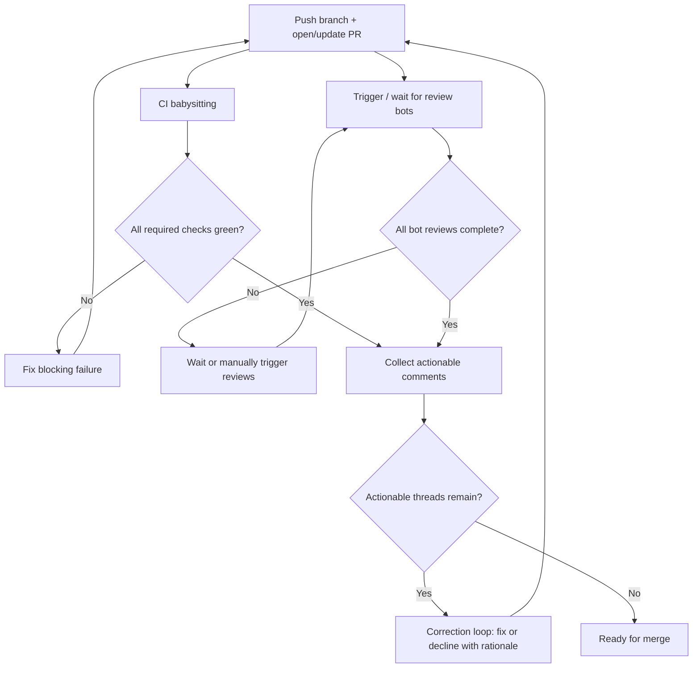

# PR Review & Correction Loop Runbook

**Purpose:** Canonical, mandatory workflow for every pull request — trigger all
available review platforms, babysit CI until green, and run correction loops until
every actionable thread is resolved.

**Audience:** Maintainers, Cursor Cloud Agents, and any contributor shipping a PR.

**Authority:** This runbook is the **single source of truth** for the correction-loop
process. [PR-FEEDBACK-PLAYBOOK.md](../PR-FEEDBACK-PLAYBOOK.md) explains philosophy and
tool roles; this document is the **operational checklist**.

**Last updated:** 2026-07-04

---

## 1. Policy (non-negotiable)

Every PR branch must complete **all** of the following before merge:

1. **Required CI gates green** — see [ci-primary-gate.md](ci-primary-gate.md) and
   [pr-status-checks.md](pr-status-checks.md).
2. **All advisory review platforms polled** — CodeRabbit, CodeAnt.ai, DeepSource,
   Codecov (and any other bot that comments on the PR).
3. **Correction loops finished** — every actionable inline/summary comment is either
   fixed in code or explicitly declined with a written rationale and thread resolved.
4. **Re-push after fixes** — each fix commit re-triggers CI and reviews; repeat until
   stable green.

> **Agents (Cursor Cloud):** Do not declare a PR "done" after the first green CI run.
> Wait for AI reviewers to finish, address their threads, push fixes, and re-verify.
> Merge only after the maintainer merges (or explicitly asks you to stop).

---

## 2. End-to-end flow



---

## 3. Step 0 — Open the PR and push early

```bash
git checkout -b cursor/<descriptive-name>-f380
# ... implement ...
git add -A && git commit -m "feat(scope): description"
git push -u origin cursor/<descriptive-name>-f380
gh pr create --draft --base main --title "..." --body "..."
```

Push **before** heavy local verification when cloud CI is the source of truth
(see `CLAUDE.md` cloud-first policy). Local minimum before push:
`pnpm type-check` → `pnpm lint` → targeted unit tests for touched files.

---

## 4. Step 1 — Trigger and wait for all review platforms

### Automatic (no action needed on push)

| Platform | Trigger | What to wait for |
|----------|---------|------------------|
| **GitHub Actions CI** | `pull_request` on branch | `✅ CI Passed`, `Security Gate`, `🎭 E2E Tests`, `Unit Tests`, … |
| **Lighthouse CI** | `pull_request` | `lighthouse` check |
| **Chromatic** | `pull_request` | `chromatic` check |
| **DeepSource** | GitHub App on PR sync | `DeepSource: JavaScript`, `DeepSource: Docker`, … report card |
| **Codecov** | `codecov/codecov-action` in `ci.yml` | `codecov/patch` + PR comment |
| **CodeRabbit** | GitHub App (`.coderabbit.yaml` `auto_review`) | Summary comment + inline threads |
| **CodeAnt.ai** | GitHub App (`.codeant/`) | `CodeAnt AI` check + inline comments |
| **Socket / GitGuardian** | GitHub App | Security alerts on PR |
| **PR feedback summary** | `pr-feedback-summary.yml` | `github-actions[bot]` comment with links |

### Manual triggers (when a bot did not run or review is stale)

Post these as **PR comments** (maintainer or agent via `gh pr comment`):

| Platform | Command / action | When to use |
|----------|------------------|-------------|
| **CodeRabbit** | `@coderabbitai review` | No summary after ~10 min, or after large rebase |
| **CodeRabbit** | `@coderabbitai full review` | Request full re-review of entire diff |
| **CodeRabbit** | `@coderabbitai help` | List available commands |
| **DeepSource AI** | `@deepsourcebot review` | DeepSource report card says AI review not run |
| **CodeAnt** | Re-sync: push empty commit or close/reopen PR | If `CodeAnt AI` check missing after 15 min |
| **Codecov** | Re-run `ci.yml` workflow | If upload failed; check `CODECOV_TOKEN` secret |

Example (agent):

```bash
gh pr comment 265 --body "@coderabbitai review"
gh pr comment 265 --body "@deepsourcebot review"
```

### Poll commands (agents — non-interactive)

```bash
# CI status for branch
GH_PAGER=cat PAGER=cat gh run list --branch cursor/<branch> --limit 5

# Single workflow detail
GH_PAGER=cat PAGER=cat gh run view <run-id> --json status,conclusion,jobs

# PR check rollup
GH_PAGER=cat PAGER=cat gh pr view <num> --json statusCheckRollup,reviewDecision

# Inline review threads (GraphQL)
GH_PAGER=cat PAGER=cat gh api graphql -f query='
query { repository(owner:"qnbs", name:"Nexus-HEMS-Dash") {
  pullRequest(number:<num>) {
    reviewThreads(first:100) {
      nodes { isResolved comments(first:1) { nodes { author { login } path line body } } }
    }
  }
}}'

# Issue comments (bot summaries)
GH_PAGER=cat PAGER=cat gh api repos/qnbs/Nexus-HEMS-Dash/issues/<num>/comments \
  --jq '.[] | {user: .user.login, updated: .updated_at}'
```

**Do not use** `gh run watch` in agent shells (TTY/control-sequence noise). Poll with
`gh run view` instead.

---

## 5. Step 2 — CI babysitting

### Required green checks (merge blockers)

See [pr-status-checks.md](pr-status-checks.md). At minimum:

- `✅ CI Passed` (rollup)
- `Security Gate`
- `Lint & Type Check`, `Unit Tests`, `Build`, `🎭 E2E Tests`, `Security Fuzz Tests`
- `lighthouse`
- `chromatic` (when token configured)

### On failure

1. Open the failing job log: `gh run view <id> --log-failed`.
2. Match failure to runbook:
   - CI → [ci-primary-gate.md](ci-primary-gate.md)
   - Security → [security-full-gate.md](security-full-gate.md)
   - Coverage floor → [working-with-coverage.md](working-with-coverage.md)
   - Lighthouse → fix perf/a11y budget or document waiver in PR
3. Fix locally, commit, push, return to Step 1.

### Local pre-push loop (when CI unavailable)

```bash
pnpm type-check
pnpm lint
pnpm --filter @nexus-hems/api exec vitest run path/to/changed.test.ts
# E2E only when touching Playwright specs or WS/proxy paths:
pnpm --filter @nexus-hems/web exec playwright test tests/e2e/<spec>.spec.ts
```

---

## 6. Step 3 — Correction loops (per platform)

Process **every unresolved inline thread** and **every actionable summary bullet**.
Order: blocking CI first, then DeepSource major/critical, then AI reviewers.

### 6.1 CodeRabbit

- **Read:** summary comment + inline `coderabbitai` threads.
- **Fix:** apply when correct and safe; never auto-apply on
  `apps/api/src/protocols/**`, `command-safety`, auth, or rate limits without human
  review.
- **Decline:** reply with technical rationale, resolve thread.
- **Re-trigger:** push fix commit (auto) or `@coderabbitai review`.
- **Runbook:** [coderabbit-integration.md](coderabbit-integration.md)

### 6.2 CodeAnt.ai

- Same safety rules as CodeRabbit.
- **Runbook:** [codeant-ai-integration.md](codeant-ai-integration.md)

### 6.3 DeepSource

- Fix `critical` / `major` / `security` inline annotations first.
- Use `// skipcq: RULE — reason` only with explicit rule code + justification.
- **Runbook:** [deepsource-integration.md](deepsource-integration.md)

### 6.4 Codecov

- Advisory only — does not block merge.
- If patch coverage is low, add targeted tests for new branches (especially adapters,
  WS command paths, safety guards).
- Blocking floor remains `scripts/check-coverage-baseline.mjs` in CI.
- **Runbook:** [working-with-coverage.md](working-with-coverage.md)

### 6.5 Human reviewers

- Address `@qnbs` or maintainer comments with the same fix-or-decline discipline.
- Resolve threads only after the reviewer agrees or the rationale is documented.

---

## 7. Step 4 — Exit criteria (ready to merge)

- [ ] All **required** GitHub checks green on the **latest** commit.
- [ ] CodeRabbit review **complete** (not "in progress") and all actionable threads
      resolved.
- [ ] CodeAnt review complete (or confirmed unavailable) and threads resolved.
- [ ] DeepSource: no unaddressed `critical`/`major` inline issues (or documented
      suppressions).
- [ ] Codecov: no unexpected coverage regression on safety-critical paths (advisory).
- [ ] `FEATURE_STATUS.md` / audit docs updated if feature status changed.
- [ ] Maintainer merge (agents do not self-merge unless explicitly instructed).

---

## 8. Safety-critical correction rules

Never "fix" a review comment by weakening:

- `READ_ONLY_MODE` guards
- JWT scope / rate limits
- Zod validation on commands or datapoints
- Adapter allowlists / circuit breakers
- CSP / auth / mTLS proxy constraints

If a bot suggests such a change, **decline the thread** and cite
[docs/Safety-Certification-Notice.md](../Safety-Certification-Notice.md).

---

## 9. Agent checklist (copy for every PR turn)

```
[ ] Push latest commit
[ ] Poll CI — all required jobs green on latest SHA?
[ ] CodeRabbit finished? (not "review in progress")
[ ] CodeAnt finished?
[ ] DeepSource / Codecov summaries read?
[ ] All inline threads: fixed OR declined + resolved?
[ ] If fixes pushed → go to top (re-poll CI + reviews)
[ ] Update PR description if scope changed
[ ] Hand off for merge when exit criteria met
```

---

## 10. Related documents

- [../PR-FEEDBACK-PLAYBOOK.md](../PR-FEEDBACK-PLAYBOOK.md) — philosophy & tool roles
- [pr-status-checks.md](pr-status-checks.md) — required vs advisory checks
- [ci-primary-gate.md](ci-primary-gate.md) — CI job map
- [coderabbit-integration.md](coderabbit-integration.md)
- [codeant-ai-integration.md](codeant-ai-integration.md)
- [deepsource-integration.md](deepsource-integration.md)
- [working-with-coverage.md](working-with-coverage.md)
- [../../DEVOPS.md](../../DEVOPS.md) — three-layer quality model (ADR-027)
- [../../AGENTS.md](../../AGENTS.md) — Cursor Cloud agent context
