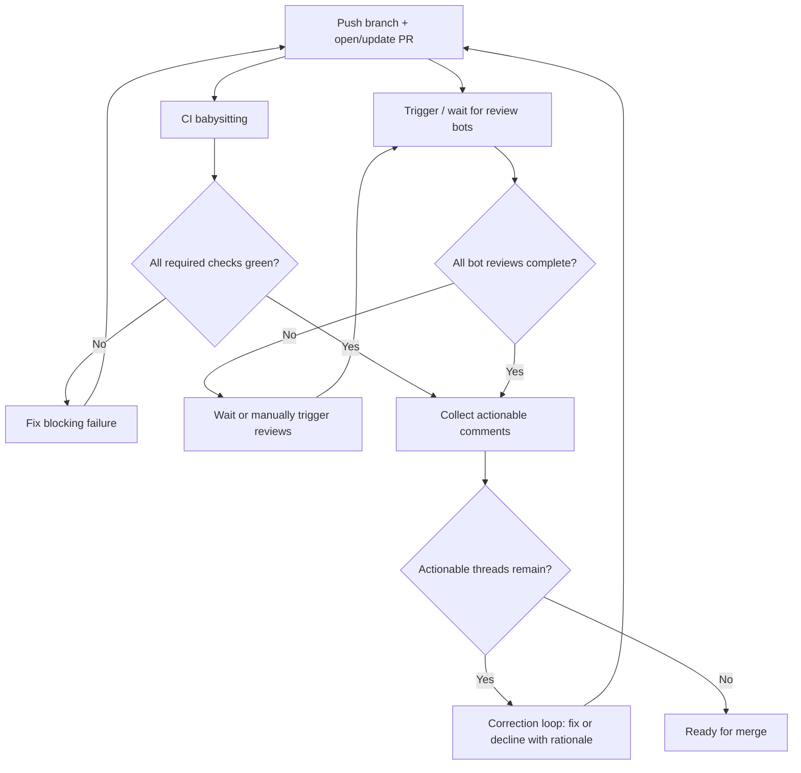

# PR Review & Correction Loop Runbook

**Purpose:** Canonical, mandatory workflow for every pull request — trigger all
available review platforms, babysit CI until green, and run correction loops until
every actionable thread is resolved.

**Audience:** Maintainers, Cursor Cloud Agents, and any contributor shipping a PR.

**Authority:** This runbook is the **single source of truth** for the correction-loop
process. [PR-FEEDBACK-PLAYBOOK.md](../PR-FEEDBACK-PLAYBOOK.md) explains philosophy and
tool roles; this document is the **operational checklist**.

**Last updated:** 2026-09-01

---

## 1. Policy (non-negotiable)

Every PR branch must complete **all** of the following before merge to `main`:

1. **Required CI gates green** — see [ci-primary-gate.md](ci-primary-gate.md) and
   [pr-status-checks.md](pr-status-checks.md).
2. **All advisory review platforms polled** — CodeRabbit, CodeAnt.ai, DeepSource,
   Codecov, Sourcery, Amazon Q Developer, and any other bot that comments on the PR.
3. **Review quiescence reached** — see §1.1 below. Merge is **forbidden** until
   quiescence is achieved on the **latest** commit SHA.
4. **Correction loops finished** — every actionable item from every platform is either
   fixed in code or explicitly declined with a written rationale and the GitHub
   thread resolved.
5. **Re-push after fixes** — each fix commit re-triggers CI and reviews; repeat from
   step 2 until quiescence.

> **Agents (Cursor Cloud):** Do not declare a PR "done" or merge to `main` after the
> first green CI run. Poll all review bots, address **every** actionable thread
> (including nitpicks and CodeRabbit outside-diff comments), push fixes, and loop until
> quiescence. Merge only when exit criteria in §7 are satisfied or the maintainer
> explicitly instructs you to stop.

### 1.1 Review quiescence (definition)

**Quiescence** means: on the current PR head SHA, after all configured review bots have
finished (status not "in progress" / "queued"), there are **zero** remaining actionable
review items from **any** source.

| Source | What counts as actionable | Included in quiescence? |
|--------|---------------------------|-------------------------|
| GitHub inline review threads | Unresolved `coderabbitai`, `codeant-ai`, human, bot threads | **Yes** — all severities including nitpick |
| CodeRabbit summary comment | Unaddressed bullets in the latest summary | **Yes** |
| CodeRabbit **outside diff range** | Items in `⚠️ Outside diff range comments` `<details>` (review body only) | **Yes — mandatory**; invisible to `reviewThreads` |
| CodeAnt.ai | Inline + summary suggestions | **Yes** |
| DeepSource | `critical` / `major` / `security` inline annotations | **Yes** |
| Sourcery / Amazon Q / other bots | Actionable inline or summary findings | **Yes** |
| Codecov patch gaps | Missing lines on safety-critical paths | **Yes** (add tests or document why unreachable) |
| Pure praise / "LGTM" / duplicate noise | No code change requested | No |

**Nitpicks are not optional.** If a bot labels a finding as nitpick, minor, or quick win,
it still must be **fixed or declined with rationale** before merge unless the maintainer
explicitly waives it in a PR comment.

**Quiescence loop (repeat until stable):**

1. Push commit → wait for CI green + all review bots complete on that SHA.
2. Collect **all** actionable items: GraphQL unresolved threads **and**
   `./scripts/fetch-coderabbit-outside-diff.sh <pr>`.
3. Fix or decline each item; resolve GitHub threads; push.
4. If step 1 produced **new** actionable comments on the new SHA → go to step 2.
5. **Quiescent** when step 4 finds nothing new after a full bot pass on the latest SHA.

**Never** treat "0 unresolved `reviewThreads`" as done without the outside-diff fetch.
**Never** merge with open review conversations on GitHub.

---

## 2. End-to-end flow


```mermaid
flowchart TD
    A[Push branch + open/update PR] --> B[CI babysitting]
    A --> C[Trigger / wait for review bots]

    B --> D{All required checks green?}
    C --> E{All bot reviews complete?}

    D -->|No| F[Fix blocking failure]
    E -->|No| G[Wait or manually trigger reviews]

    F --> A
    G --> C

    D -->|Yes| H[Collect actionable comments]
    E -->|Yes| H

    H --> I{Actionable threads remain?}
    I -->|Yes| J[Correction loop: fix or decline with rationale]
    J --> A
    I -->|No| K[Ready for merge]
```

---

## 3. Step 0 — Open the PR and push early

```bash
git checkout -b cursor/<descriptive-name>-f380
# ... implement ...
git add -A && git commit -m "feat(scope): description"
git push -u origin cursor/<descriptive-name>-f380
gh pr create --draft --base main --title "..." --body "..."
```

Push **before** heavy local verification when cloud CI is the source of truth
(see `CLAUDE.md` cloud-first policy). Local minimum before push:
`pnpm type-check` → `pnpm lint` → targeted unit tests for touched files.

---

## 4. Step 1 — Trigger and wait for all review platforms

### Automatic (no action needed on push)

| Platform | Trigger | What to wait for |
|----------|---------|------------------|
| **GitHub Actions CI** | `pull_request` on branch | `✅ CI Passed`, `Security Gate`, `🎭 E2E Tests`, `Unit Tests`, … |
| **Lighthouse CI** | `pull_request` | `lighthouse` check |
| **Chromatic** | `pull_request` | `chromatic` check |
| **DeepSource** | GitHub App on PR sync | `DeepSource: JavaScript`, `DeepSource: Docker`, … report card |
| **Codecov** | `codecov/codecov-action` in `ci.yml` | `codecov/patch` + PR comment |
| **CodeRabbit** | GitHub App (`.coderabbit.yaml` `auto_review`) | Summary comment + inline threads |
| **CodeAnt.ai** | GitHub App (`.codeant/`) | `CodeAnt AI` check + inline comments |
| **Socket / GitGuardian** | GitHub App | Security alerts on PR |
| **PR feedback summary** | `pr-feedback-summary.yml` | `github-actions[bot]` comment with links |

### Manual triggers (when a bot did not run or review is stale)

**Preferred (agents + maintainers):** push a commit — `.github/workflows/coderabbit-rereview.yml`
posts `@coderabbitai review` automatically when the head SHA has no CodeRabbit review yet.

**Maintainer-only** (agents get `403` on `gh pr comment`):

| Platform | Command / action | When to use |
|----------|------------------|-------------|
| **CodeRabbit** | `@coderabbitai review` (PR comment) | No summary after ~10 min, or after large rebase |
| **CodeRabbit** | `gh workflow run coderabbit-rereview.yml -f pr_number=<num>` | Manual re-trigger without a new commit |
| **CodeRabbit** | `./scripts/request-coderabbit-review.sh <num>` | Local helper (falls back to workflow dispatch) |
| **CodeRabbit** | `@coderabbitai full review` | Request full re-review of entire diff |
| **CodeRabbit** | `@coderabbitai help` | List available commands |
| **DeepSource AI** | `@deepsourcebot review` | DeepSource report card says AI review not run |
| **CodeAnt** | Re-sync: push empty commit or close/reopen PR | If `CodeAnt AI` check missing after 15 min |
| **Codecov** | Re-run `ci.yml` workflow | If upload failed; check `CODECOV_TOKEN` secret |

Example (maintainer — agents should push commits instead):

```bash
./scripts/request-coderabbit-review.sh 265
gh pr comment 265 --body "@deepsourcebot review"
```

### Poll commands (agents — non-interactive)

```bash
# CI status for branch
GH_PAGER=cat PAGER=cat gh run list --branch cursor/<branch> --limit 5

# Single workflow detail
GH_PAGER=cat PAGER=cat gh run view <run-id> --json status,conclusion,jobs

# PR check rollup
GH_PAGER=cat PAGER=cat gh pr view <num> --json statusCheckRollup,reviewDecision

# Inline review threads (GraphQL)
GH_PAGER=cat PAGER=cat gh api graphql -f query='
query { repository(owner:"qnbs", name:"Nexus-HEMS-Dash") {
  pullRequest(number:<num>) {
    reviewThreads(first:100) {
      nodes { isResolved comments(first:1) { nodes { author { login } path line body } } }
    }
  }
}}'

# Issue comments (bot summaries)
GH_PAGER=cat PAGER=cat gh api repos/qnbs/Nexus-HEMS-Dash/issues/<num>/comments \
  --jq '.[] | {user: .user.login, updated: .updated_at}'

# CodeRabbit outside-diff (NOT in reviewThreads — review bodies only)
./scripts/fetch-coderabbit-outside-diff.sh <num>
```

**Do not use** `gh run watch` in agent shells (TTY/control-sequence noise). Poll with
`gh run view` instead.

---

## 5. Step 2 — CI babysitting

### Required green checks (merge blockers)

See [pr-status-checks.md](pr-status-checks.md). At minimum:

- `✅ CI Passed` (rollup)
- `Security Gate`
- `Lint & Type Check`, `Unit Tests`, `Build`, `🎭 E2E Tests`, `Security Fuzz Tests`
- `lighthouse`
- `chromatic` (when token configured)

### On failure

1. Open the failing job log: `gh run view <id> --log-failed`.
2. Match failure to runbook:
   - CI → [ci-primary-gate.md](ci-primary-gate.md)
   - Security → [security-full-gate.md](security-full-gate.md)
   - Coverage floor → [working-with-coverage.md](working-with-coverage.md)
   - Lighthouse → fix perf/a11y budget or document waiver in PR
3. Fix locally, commit, push, return to Step 1.

### Local pre-push loop (when CI unavailable)

```bash
pnpm type-check
pnpm lint
pnpm --filter @nexus-hems/api exec vitest run path/to/changed.test.ts
# E2E only when touching Playwright specs or WS/proxy paths:
pnpm --filter @nexus-hems/web exec playwright test tests/e2e/<spec>.spec.ts
```

---

## 6. Step 3 — Correction loops (per platform)

Process **every unresolved inline thread** and **every actionable summary bullet**.
Order: blocking CI first, then DeepSource major/critical, then AI reviewers.

### 6.1 CodeRabbit

- **Read:** summary comment + inline `coderabbitai` threads **and** outside-diff comments
  (see below).
- **Fix:** apply when correct and safe; never auto-apply on
  `apps/api/src/protocols/**`, `command-safety`, auth, or rate limits without human
  review.
- **Decline:** reply with technical rationale, resolve thread.
- **Re-trigger:** push fix commit (auto) or `@coderabbitai review`.
- **Runbook:** [coderabbit-integration.md](coderabbit-integration.md)

#### Outside-diff comments (platform limitation) — MANDATORY every round

CodeRabbit may post: *"Some comments are outside the diff and can't be posted
inline."* Those findings live only in **review bodies** (the `⚠️ Outside diff
range comments (N)` `<details>` block), **not** in GraphQL `reviewThreads`. They
are invisible to a threads-only fetch, so **every** review round MUST run the
outside-diff fetch below alongside the `reviewThreads` query — never treat a
green `reviewThreads` sweep as "0 unresolved" until outside-diff is also empty.
A round is not quiescent while any outside-diff item is unaddressed.

```bash
# All outside-diff sections for a PR (maintainer/agent)
./scripts/fetch-coderabbit-outside-diff.sh <pr-number>

# Equivalent one-liner
GH_PAGER=cat PAGER=cat gh api "repos/qnbs/Nexus-HEMS-Dash/pulls/<num>/reviews?per_page=100" \
  --jq '.[].body' | rg -n "Outside diff|⚠️ Outside" -A 20
```

**Workflow:** after inline threads are clear, run the script above, fix each
outside-diff item in code (or decline with rationale in a PR comment), push, and
re-request `@coderabbitai review`.

### 6.2 CodeAnt.ai

- Same safety rules as CodeRabbit.
- **Runbook:** [codeant-ai-integration.md](codeant-ai-integration.md)

### 6.3 DeepSource

- Fix `critical` / `major` / `security` inline annotations first.
- Use `// skipcq: RULE — reason` only with explicit rule code + justification.
- **Runbook:** [deepsource-integration.md](deepsource-integration.md)

### 6.4 Codecov

- **Proactive correction loop (mandatory):** when Codecov reports patch coverage gaps,
  add or extend unit/integration tests in the same PR until the patch report is green
  or only uncovered lines are genuinely unreachable (document why in the PR).
- Prioritize tests for new branches in safety-critical paths: protocol adapters, WS
  command dispatch, allowlists, read-only guards, and error paths.
- Advisory merge gate — does not block merge by itself.
- Blocking floor remains `scripts/check-coverage-baseline.mjs` in CI.
- **Runbook:** [working-with-coverage.md](working-with-coverage.md)

**Agent workflow when Codecov comments `Patch coverage is X%`:**

1. Open the Codecov PR report → **Files with missing lines**.
2. For each file in the diff, add targeted tests (happy path + failure path).
3. Run `pnpm --filter @nexus-hems/api exec vitest run <test-file>` locally.
4. Push; wait for Codecov to refresh; repeat until patch coverage is acceptable.

### 6.5 Human reviewers

- Address `@qnbs` or maintainer comments with the same fix-or-decline discipline.
- Resolve threads only after the reviewer agrees or the rationale is documented.

---

## 7. Step 4 — Exit criteria (ready to merge)

Merge to `main` is allowed **only** when **review quiescence** (§1.1) is reached **and**:

- [ ] All **required** GitHub checks green on the **latest** commit.
- [ ] Every review bot has **finished** on the latest SHA (not "in progress" / "queued").
- [ ] **Zero** unresolved GitHub review threads (inline), **all severities** including nitpick.
- [ ] CodeRabbit outside-diff fetch run on latest SHA and **zero** unaddressed items:
      `./scripts/fetch-coderabbit-outside-diff.sh <pr>`
- [ ] CodeRabbit summary: no unaddressed actionable bullets on latest review.
- [ ] CodeAnt (and Sourcery / Amazon Q / other bots): no unaddressed actionable items.
- [ ] DeepSource: no unaddressed `critical`/`major` inline issues (or documented suppressions).
- [ ] Codecov: no unexpected patch gaps on safety-critical paths (advisory but mandatory to address).
- [ ] A fix push after the last review round did **not** produce new actionable comments
      (quiescence confirmed).
- [ ] `FEATURE_STATUS.md` / audit docs updated if feature status changed.
- [ ] Maintainer merge (agents merge only when explicitly instructed; still must reach quiescence first).

---

## 8. Safety-critical correction rules

Never "fix" a review comment by weakening:

- `READ_ONLY_MODE` guards
- JWT scope / rate limits
- Zod validation on commands or datapoints
- Adapter allowlists / circuit breakers
- CSP / auth / mTLS proxy constraints

If a bot suggests such a change, **decline the thread** and cite
[docs/Safety-Certification-Notice.md](../Safety-Certification-Notice.md).

---

## 9. Agent checklist (copy for every PR turn)

```text
[ ] Push latest commit
[ ] Poll CI — all required jobs green on latest SHA?
[ ] All review bots finished on latest SHA? (not queued/in progress)
[ ] Unresolved reviewThreads count = 0 (all severities, incl. nitpick)?
[ ] CodeRabbit outside-diff: ./scripts/fetch-coderabbit-outside-diff.sh <pr> — all addressed?
[ ] CodeRabbit summary bullets — all addressed or declined?
[ ] CodeAnt / Sourcery / Amazon Q / other bots — all actionable items addressed?
[ ] DeepSource / Codecov summaries read and addressed?
[ ] If fixes pushed → re-poll CI + ALL reviews; repeat until QUIESCENCE (no new actionable items)
[ ] Update PR description if scope changed
[ ] Merge only when quiescent + exit criteria (§7) met
```

---

## 10. Related documents

- [../PR-FEEDBACK-PLAYBOOK.md](../PR-FEEDBACK-PLAYBOOK.md) — philosophy & tool roles
- [pr-status-checks.md](pr-status-checks.md) — required vs advisory checks
- [ci-primary-gate.md](ci-primary-gate.md) — CI job map
- [coderabbit-integration.md](coderabbit-integration.md)
- [codeant-ai-integration.md](codeant-ai-integration.md)
- [deepsource-integration.md](deepsource-integration.md)
- [working-with-coverage.md](working-with-coverage.md)
- [../../DEVOPS.md](../../DEVOPS.md) — three-layer quality model (ADR-027)
- [../../AGENTS.md](../../AGENTS.md) — Cursor Cloud agent context
